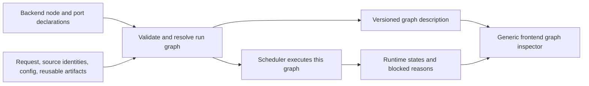
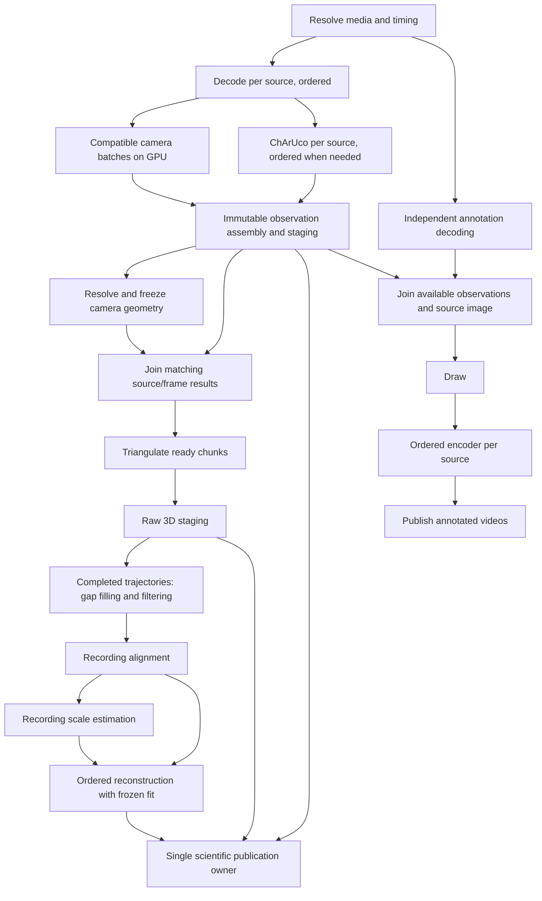

# Executable processing graphs and their inspector

Status: proposed architecture, 2026-10-05. Source audit and migration design; the
runtime and frontend described below are not implemented by this document.

The owner requests a graph-first redesign, informed by SkellySpeak: the graph
that determines execution must also determine the graph the user inspects.
Start with mocap/posthoc. Share vocabulary and scientific handlers with realtime;
do not force realtime and posthoc into identical scheduling or filtering semantics.
Calibration remains a separate task. Preserve the [recording contract](../../RECORDING_CONTRACT.md).

## Verified reference: what SkellySpeak actually does

Read-only source inspection of the local `other/skellyspeak` checkout found:

| Source under SkellySpeak | Verified behavior |
| --- | --- |
| `native/src/conversations/turn_plan.rs` | Native declarations own operation kinds, dependencies, activation, resource roles, and contract versions. |
| `native/src/conversations/execution/graph.rs` | Dependency readiness and release of dependent work resolve those same declarations. |
| `native/src/conversations/execution/dispatch.rs` | Dispatch rechecks dependencies; a manually set ready flag cannot bypass them. Operation-specific input assembly still exists here. |
| `native/src/conversations/execution/snapshots.rs` | Runtime snapshots derive dependency operation IDs, role, and contract version from declarations. |
| `native/src/diagnostics/ai_graphs.rs` | Definition inspection copies dependency relationships from the declarations; enriches them with descriptions, source references, prompts, and schemas. |
| `ui/src/features/activity/graph-layout.ts` | Generic frontend derives edges and depth from received dependencies, rejecting duplicates, dangling references, and cycles. |
| `native/src/conversations/execution/tests/graph.rs` | Tests that declarations govern release, dispatch, and inspection. |
| `ui/tests/architecture/ai-graph-source.test.ts` | Source checks prohibit a second UI-authored collection of operations/dependencies. |

The user's recollection is correct for the declared conversation operation graphs.
The important qualification: this is not proof that every input read, resource wait,
or scheduling choice is represented by a graph edge. Descriptions still have authors;
dispatch contains operation-specific hydration; admission policy is separate from
the dependency declarations. Inspection also includes standalone operations outside
the conversation plans. Copy the single-authority principle, not an assumption that
its existing scheduler is a complete streaming dataflow engine. No SkellySpeak tests
were executed and no SkellySpeak files were changed for this audit.

## Current FreeMoCap mismatch

- `posthoc/stage_dependencies.py` declares scientific prerequisites for saved-result
  reuse and invalidation. It does not schedule work concurrently.
- `posthoc/mocap_detection.py` schedules decoding, a synchronized tracker batch,
  and annotation by manually awaiting futures in a loop.
- `posthoc/mocap_video_node.py` combines decoding, ChArUco computation, mutation of
  an observation, drawing, and encoding. Annotation completion gates the next batch.
- `inference_service.py` owns model execution, per-client state, one outstanding
  request per client, consecutive posthoc frame ordinals, and realtime preference.
- `posthoc/mocap_pipeline.py` collects every observation before downstream work.
- `tasks/mocap/posthoc_mocap_task.py` sequences numerical stages and three checkpoint
  publications. Current publication rewrites retained Parquet content; health report
  generation also occurs synchronously in `parquet_writer.py`.
- `posthoc/task_snapshot.py` and frontend progress cards expose phases and camera
  progress, not the actual execution dependencies, queues, or resource waits.

A diagram layered over these loops would create exactly the second authority the
owner wants to avoid. During migration, unmigrated composite work must be displayed
as an opaque legacy node, never expanded into a falsely authoritative graph.

## One authored definition; one resolved graph per run

Author input bindings once. Derive dependency edges from bindings; do not also
author a separate `depends_on` list. The compiler validates them and produces a
frozen resolved graph shared by execution and inspection. Serializing this graph
is a projection of the same object, not another manually maintained specification.

Keep distinct concepts explicit:

| Concept | Contract |
| --- | --- |
| Node definition | Named operation, typed input/output ports, handler binding and version, execution scope, state/ordering policy, resource requirements, failure policy. |
| Input binding / edge | Producer output to consumer input, key relationship, fan-in rule, completion rule, delivery/storage policy. |
| Resolved node | Concrete run configuration and partitions, e.g. decoder for source C1. Conditional nodes and reused artifacts are resolved here. |
| Work item | A node invocation for a frame, chunk, trajectory, or recording. Not a new frontend node for every frame. |
| Worker | A thread/process/device executor chosen under the node's resource policy. A node is not synonymous with a process. |
| Artifact | Typed immutable data or a reference to data, with source/version identity. An in-memory result is not automatically a durable checkpoint. |
| Graph description | Serializable resolved topology and contracts; no pixel arrays or execution objects. |
| Run snapshot | Node/edge state for that graph revision: counts, queues, waits, timings, failures, and completion. |

Use existing observation, geometry, timing, reconstruction, and recording models
as port payloads. Avoid a parallel generic dictionary data model or a new recording
identity hierarchy. Operational task/attempt identities are distinct from retained
scientific run IDs already defined in the recording contract.

## Readiness is about data, not completion of an entire producer

A streaming input can become ready when a matching item exists while its producer
continues running. A recording-wide input can require a sealed stream or artifact.
The scheduler must distinguish these rather than treating all edges as
"wait for the previous node to finish."

Proposed binding semantics:

- `same_key`: consume an item with the same sensor-group/frame key.
- `join_sources`: collect one terminal observation result per configured source for
  that frame. An empty detection is a result; a missing producer response is not.
- `broadcast`: share a frozen configuration, resolved geometry, or model fit.
- `ordered_partition`: preserve state transitions in source/frame order.
- `sealed_input`: wait for all required input for a recording or completed trajectory.

These are proposed contracts, not new Python API names already in the repository.
Keys preserve the existing synchronized sensor-group ordinal and timestamp semantics;
independent camera progress must not redefine synchronization or source identity.
End-of-stream messages declare coverage. A missing frame then fails or follows an
explicit missing-data policy; it cannot leave a join waiting forever.

Hydration resolves declared input bindings to ready artifacts and supplies only those
inputs plus narrow execution capabilities. Handlers must not wait on another node's
future, fetch undeclared scientific inputs from a global store, or schedule hidden
child work. Opaque third-party execution is allowed, but its boundary must be labeled.
Output publication releases matching dependent work immediately.

## Proposed mocap graph

This is a conceptual design illustration. The production visualization must be
generated from the executable definition, not copied from this Mermaid diagram.

There is no annotation-to-inference or annotation-to-triangulation edge. If body
and board observations have different consumers, bind those consumers to the required
output ports; do not make all body processing wait for an irrelevant board result.
When board tracking is disabled, resolve the graph without that required branch.

Preserve existing algorithms initially:

- Tracker state remains ordered per source. The first implementation retains the
  synchronized camera batch contract supported by `InferenceService`; independently
  advancing camera inference requires a later explicit service/state API change.
- GPU batching is resource scheduling, not a scientific fan-in requirement. All
  camera observations are required by a join, not intrinsically by each pose model.
- Current automatic camera matching samples the whole recording. Use an explicit
  matching prepass or retain that barrier. Do not claim immediate triangulation while
  silently changing matching evidence to the first few frames.
- With resolved geometry, triangulation can consume chunks before annotation completes.
  Verify chunked output, ordering, missing-data handling, and diagnostics against the
  current whole-recording solver.
- Gap filling and forward/backward filtering require future trajectory samples.
  Alignment and scale fit use recording-wide evidence. Keep these barriers visible.
- Reconstruction carries temporal state. Parallelize independent subjects/partitions
  only where the algorithms support that independence; do not reorder a stateful stream.

## Fan-out must have an explicit lifetime and memory policy

Sending each frame to two bounded queues does not guarantee annotation independence:
the slow annotation queue can fill and backpressure the producer anyway. Declare this
effect and expose it. Unbounded queues merely trade the stall for memory exhaustion.

Recommended first policy: scientific observations enter bounded staging with disk
spill; annotation consumes those observations and independently rereads source video.
This spends decoding work to avoid retaining full-resolution pixels for a slow encoder.
A later bounded shared-frame cache may optimize reads, with rereading as fallback.
Disk quotas and exhaustion remain explicit errors; no infinite-storage promise.

Staging is operational scratch, not an alternative canonical recording store. Specify
its ownership, budget, cleanup, and whether it survives process restart before writing
it. All generated paths must be ignored or outside the source checkout. Persistent
restart semantics remain based on validated canonical checkpoints unless separately
implemented and tested. Preserve completed scientific outputs if annotation fails;
report the overall task as partial/failed-derived-output when requested videos are
incomplete, not as an unqualified success.

Only the publication owner replaces canonical Parquet and allocates retained runs.
Do not let concurrent scientific nodes write that file. Separate computation readiness
from checkpoint durability. A stage requiring durable input must declare that condition;
others consume immutable in-memory/staged results. Preserve atomic replacement,
validation, provenance, source geometry, and human keep/overwrite semantics.

## Data graph, resource placement, and live waits

The data graph alone cannot explain all stalls. A node may have all inputs but wait
for GPU admission, its own prior state transition, a full output buffer, or a writer.
Represent resource and ordering policies in the compiled plan and report actual waits.
Do not draw a fake data dependency to explain resource contention.

The scheduler should be event-driven with bounded admission. Release work on input
publication, capacity return, or predecessor-state completion. A node holding a worker
must not block indefinitely waiting for downstream capacity while the consumer needs
that same exhausted worker pool. Reserve/claim capacity in a defined order or yield
work back to the scheduler. Detect stalled joins and exhausted partitions explicitly.

Use a deliberate GPU execution owner and bounded CPU/I/O/encoder pools. Python
threads do not guarantee CPU parallelism for Python-heavy work; choose processes
only where measurements justify transfer costs and enforce artifact ownership.
Expose realtime/posthoc fairness as resource policy. Do not duplicate GPU model
sessions merely to make the diagram look parallel.

## Frontend: inspection of actual execution

Extend the existing retained task snapshot and HTTP/WebSocket delivery rather than
introducing a second independent progress registry. Separate immutable graph metadata
from frequently changing runtime state; identify both with task ID, graph digest,
schema version, server instance, and monotonic revision. Reconnect via a full snapshot;
discard updates that do not match the graph or generation.

The generic inspector derives all nodes, ports, edges, labels, source references,
partitions, and policy details from backend descriptions. Frontend owns placement,
selection, accessibility, and presentation only. Generate transport types/schema from
backend contracts using the repository's chosen tooling; do not hand-maintain duplicate
dependency lists. Large graphs collapse partitions from backend-provided grouping.

Views of the same compiled graph:

1. Definition: operations, typed ports, dependencies, activation, and barrier contracts.
2. Resolved run: actual sources, enabled branches, reuse nodes, geometry, and settings.
3. Execution: workers/resources, ready/running/blocked states, queues, and throughput.

Selecting a node answers "why is this not running?" with exact blocked inputs/keys,
ordering predecessor, resource capacity, or downstream edge. Show service time and
queue time separately, batch sizes, observed frame coverage, first-call setup, and
actual execution provider. Do not infer GPU use from requested provider configuration.
Edges show buffered count/bytes, capacity, consumer lag, and closure state. Completion
distinguishes computed, staged, committed, failed, cancelled, and blocked-by-failure.
An event timeline can explain concurrency without displaying every frame as a node.

These are proposed UI capabilities. Current phase bars and the recently added timing
report do not implement this inspector or fully expose queue/resource state.

## Derive invalidation from the same scientific bindings

Tag reusable scientific outputs with their existing processing stage and provenance.
Derive prerequisite closure from their input bindings, including settings/geometry
artifacts, so execution and saved-stage invalidation do not drift. Encoding/resource
edges must not invalidate scientific results. A graph digest is execution identity,
not a replacement for scientific provenance: changing layout, descriptions, or worker
count must not automatically invalidate identical numerical outputs.

During migration, test this projection against `stage_dependencies.py`. Replace that
authority only when saved-stage execution and its tests consume the projection. Do
not leave two independently edited dependency maps after migration.

## Concrete first slice and subsequent handoffs

Keep implementation in FreeMoCap core first, including its frontend. SkellyCam,
SkellyTracker, and SkellyForge remain independent numerical/capture packages. Their
algorithms are called by handlers; the graph engine belongs to core. Changes requiring
a dependency API need a separate repository stage and the owner's commit/push handoff.

1. Executable graph foundation plus inspector in one vertical slice. Define and validate
   typed bindings, keyed readiness, ordering, resource admission, and snapshot identity.
   Execute synthetic per-camera producers, inference, join, and a deliberately slow
   annotation branch through it. Serve that exact compiled graph to a generic UI.
   Label this a development harness until production handlers are migrated. Acceptance:
   hold annotation indefinitely and observe continued scientific work within declared
   budgets; the UI explains both branches without any hardcoded node names or edges.
2. Replace the mocap observation loop. Split ChArUco from rendering, publish immutable
   observations, connect real decoding/tracker/annotation handlers, preserve synchronized
   GPU batches initially, and eliminate the old coordinator scheduling for this path.
   Use one explicit legacy composite node for unmigrated downstream work.
3. Replace downstream composite work with real scientific nodes and one publication
   owner. Make matching/filtering/scale barriers explicit; support resolved-geometry
   chunked triangulation and existing restart/retention behavior.
4. Derive scientific invalidation/reuse from bindings and migrate saved-stage execution.
   Remove superseded dependency definitions, manual phase orchestration, and obsolete
   source comments when their callers have moved.
5. Evaluate realtime and calibration adoption independently. Share contracts, handlers,
   snapshots, and inspector; retain realtime freshness and posthoc lossless semantics.
   Optimize camera batching/state APIs only after measurements of the migrated graph.

Do not ship an inspection-only topology as if it controls the old coordinator. Each
stage should have an executable boundary, a generated view, and an explicit claim of
what remains legacy. No dependency installs, Git mutations, data migrations, or
environment changes are part of this design document.

## Required behavioral tests

- Graph compilation rejects cycles, unknown ports, incompatible payload/key contracts,
  duplicate IDs, illegal writers, and unresolved required inputs before workers start.
- Input bindings used by dispatch exactly match serialized inspection edges. Changing
  a binding changes readiness and the visual graph together.
- Branch test: blocked annotation does not delay inference or triangulation when their
  declared resources and input/output budgets remain available.
- Join tests: out-of-order arrivals, empty detections, end-of-stream with missing data,
  unequal producer speed, and bounded retained memory. No deadlocks or silent drops.
- State tests: per-camera monotonic tracker calls and independent state; preserved
  deterministic frame order for encoders and reconstruction.
- Failure tests: revoked/cancelled generations cannot publish late results; annotation
  failures preserve scientific checkpoints; scientific failure blocks dependent work.
- Publication tests: one writer, atomic files, valid prior checkpoint after failure,
  retained runs/groups preserved, restart and provenance equivalent to current behavior.
- Numerical tests: compare migrated outputs to existing reference recordings with
  stated tolerances, matching evidence, filtering support, and scale-fit semantics.
- UI tests: arbitrary backend graphs render without operation-name tables; snapshots
  survive reconnect/reordering and show concrete blocked reasons and missing inputs.
- Performance tests: report matched settings/resolutions, synchronized frames/s versus
  camera images/s, queue/compute/publication time, peak retained bytes, and provider.
  A prettier DAG is not evidence of a speedup.

## Decision summary

Adopt the SkellySpeak principle: one backend-authored definition governs execution
and inspection. Extend it for keyed streams, temporal state, finite resources,
durability, and fan-out lifetime. Migrate the actual executor together with its
frontend projection; never maintain a parallel descriptive topology. Start with a
real, testable graph slice before converting the entire scientific pipeline.
