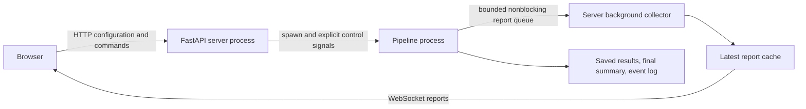

# Executable graph lab: separated server, worker and viewer

This standalone integration implements real video loading, RTMPose camera batches
on CUDA, and saving 2D results. It uses the application's FastAPI/Uvicorn stack
and `/websocket/connect` convention. The main application has not been switched
over, and this is not its existing WebSocket wire protocol. The lab defines an
explicit transport contract for that later integration. No legacy coordinator
wrapper is used.

## Start

From the core repository, using the existing environment:

```powershell
.venv/Scripts/python.exe -B -m experiments.executable_graph_lab.graph.server `
  --output-root .test-artifacts/graph-ui-runs --port 8767
```

Optionally supply `--archive <completed-run-directory>` to display an existing
`graph.json` and `summary.json` at startup. Open http://127.0.0.1:8767/.
Enter a recording folder and its video subfolder, resolve, then start. All frames
are processed. Synchronized videos must have matching frame counts. The sample
uses `synchronized_videos`; the canonical layout uses `videos/synchronized`.

The viewer source is now `web/index.html` in core, not a file in the ignored
synthetic prototype directory. The old HTTP polling server and in-process
execution controller have been removed. `inspector.py` only projects exported
work into display data; it is not a server or execution entry point.

## Process and transport boundaries



- `controller.py` supervises one spawned process. The server owns no CUDA session,
  image readers, pipeline executor or processing threads. Metadata inspection
  and graph compilation happen during HTTP configuration before execution.
- `worker.py` owns the executor and all native adapters. The worker shares no
  controller lock, Python GIL, HTTP handler or WebSocket sender with the server.
- Reports are sampled at most four times per second plus terminal/error reports.
  The IPC queue holds two reports. `put_nowait` drops reports when full. The worker
  never waits for a report acknowledgement, consumer or client connection.
  Queue feeder shutdown does not wait for a missing consumer.
- The server collects independently of connections. HTTP reads return its cache;
  they do not call the worker or trigger scheduling or graph projection.
- Every WebSocket subscriber has a one-item latest-state mailbox. A slow client
  loses intermediate updates; it cannot hold up other clients or the worker.
  A send exceeding two seconds ends that connection. Reconnect receives the
  latest full state, including graph identity. Reports are not a lossless trace.
- Only explicit HTTP pause/resume/cancel commands set worker control signals.
  WebSocket messages are rejected, and disconnect has no control effect.
- Final `summary.json` is written by the worker even if reports cannot be delivered.
  After worker exit the collector reads this durable final state. A process crash
  without a summary is reported as failed. This is a local single-server lab;
  recovery/adoption of a live worker after server crash is not implemented.
- Graceful server shutdown explicitly cancels and drains the worker. Native GPU
  calls are not forcibly interrupted. Browser shutdown is unrelated.

Reporting still consumes bounded worker CPU time to create snapshots, and all
processes share machine hardware. Isolation removes display-driven waits; it is
not a claim of zero telemetry cost or hardware resource contention.

## HTTP and WebSocket contract

- `GET /api/catalog`: task and transport capabilities.
- `GET /api/current`: cached state for initial page load; no progress polling.
- `POST /api/preview`: `{recording, video_subfolder, frames: null}`; resolves the
  full recording and returns its graph.
- `POST /api/runs`: `{config, paused: boolean}`; returns HTTP 202 with
  `{accepted: true, run_id}`. Execution progress comes through WebSocket.
- `POST /api/runs/{run_id}/control`: `{action: "pause" | "resume" | "cancel"}`;
  HTTP 202 acknowledges the command, not its execution. The worker reports its
  observed state asynchronously. Wrong/stale run identities are rejected.
- `WS /websocket/connect`: server-to-client
  `{type: "pipeline_state", revision, value: {graph, run} | null}`. Revisions
  increase within a server session; reconnect resets the client's revision guard.
  Each report is self-contained so coalescing cannot lose a graph definition.

Browser commands and WebSocket connections require the loopback origin. Output
paths are server-selected UUID directories outside the source recording. Inputs
are unchanged. Cached model weights must already exist; no implicit downloads.

## Graph and execution

`runtime.py` compiles typed inputs and outputs to keyed work; those same bindings
produce the graph view. The worker uses per-resource thread pools. Video readers
run concurrently across cameras and in order within each camera. RTMPose processes
one synchronized camera batch at a time on its GPU worker. A two-frame read-ahead
window bounds retained pixel images; it is not a total recording-length limit.
The viewer shows one progress bar per video. Loading progress includes waiting
for consumers; handler timings distinguish active work from the stage's span.

The GPU session is explicitly CUDA and models must report CUDA as their primary
provider. This does not establish per-operator placement. Shared GPU admission
with the main application's realtime tasks remains a separate integration step.
Observations currently accumulate until the final save; saving is a terminal
step. 3D, annotation and other task variants remain unconnected.

## Diagnostics and checks

Each worker run saves:

- `graph.json`: resolved executable definition and work identities.
- `events.jsonl`: every dispatch, completion and lifecycle event, written at the
  end of the run. This file is not crash-safe live event journaling.
- `summary.json`: final status, timings, worker PID, dropped-report count, CUDA
  providers and saved output paths. Independent of WebSocket delivery.
- `worker.log`: Python output and exceptions from the real worker.
- the recording-named folder containing its Parquet output and copied models.

Snapshots streamed to clients retain the latest 100 events. Work-record previews
show at most 100 entries; this does not constrain execution. Run elapsed time
starts when the worker starts and includes explicit pauses, then freezes on exit.

Run the focused tests with:

```powershell
.venv/Scripts/python.exe -B -W ignore -m unittest -q `
  experiments.executable_graph_lab.checks.checks_runtime experiments.executable_graph_lab.checks.checks_transport
```

Tests cover graph scheduling, cleanup and cancellation, timer boundaries, full
recording length, execution in a distinct process with a saturated undrained
report queue, explicit paused cancellation, subscriber coalescing, reconnect,
HTTP origin checks and rejection of WebSocket control messages.


Validation on 2026-10-06: all 14 focused tests passed. The three-camera sample
completed all 1,108 synchronized frames in a spawned worker (PID 34132), with
three viewer tabs connected. HTTP start-paused admitted no work; HTTP resume
allowed completion. The final summary reported no error and both models listed
CUDA as primary. Elapsed 86.9 seconds includes the deliberate initial pause and
is not a throughput benchmark. This run saved a complete 1.15 MB event log.
