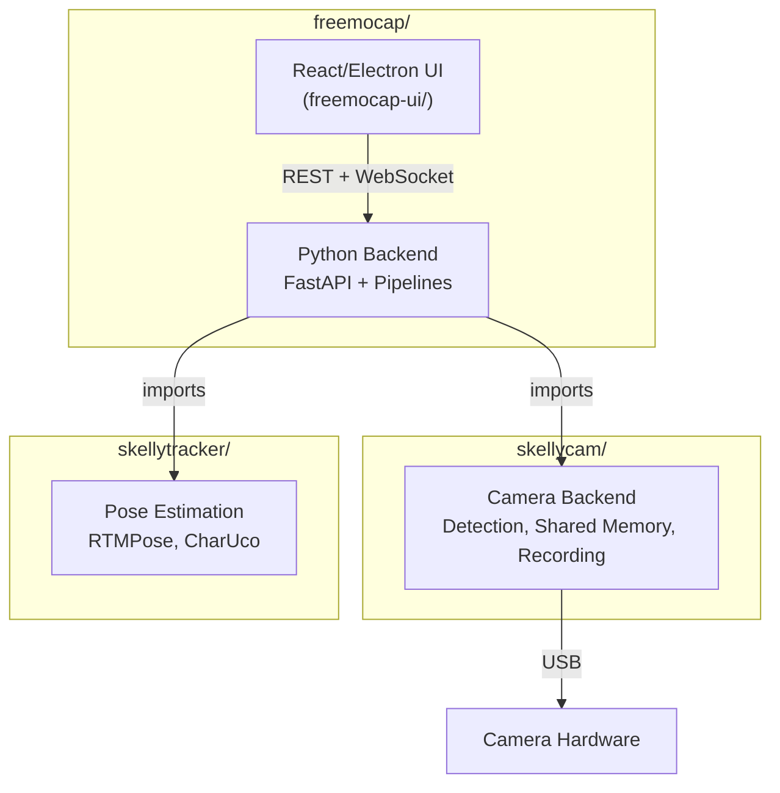

import { AiGeneratedBanner, Tip } from '@freemocap/skellydocs';

<AiGeneratedBanner />

# Backend Architecture Overview

The Python backend is a **FastAPI** application that serves as the command-and-control layer for FreeMoCap. It manages cameras (via SkellyCam), runs processing pipelines (calibration and mocap), and streams real-time data to the frontend over WebSocket.

## Polyrepo Structure

FreeMoCap spans several repositories. Understanding which repo owns which domain is essential for navigating the code.

```
freemocap/                      ← Main application (this backend + React/Electron UI)
├── freemocap/                  Python backend: FastAPI, pipelines, calibration, mocap
├── freemocap-ui/               React/TypeScript frontend
├── freemocap-docs/             This documentation site
└── shared/                     Shared code across layers

skellycam/                      ← Camera domain
├── skellycam/                  Python camera backend (detection, config, shared memory, recording)
├── skellycam-docs/             SkellyCam documentation site
├── skellycam-ui/               SkellyCam React/Electron frontend
└── skellycam-rust/             Rust rewrite (in development)

skellytracker/                  ← Pose estimation domain
    (RTMPose, CharUco detection)

skellydocs/                     ← Shared Docusaurus theme (npm package)
    (@freemocap/skellydocs)
```



<Tip shortInfo="SkellyCam has its own documentation at freemocap.github.io/skellycam. SkellyCam owns camera detection, configuration, shared memory ring buffers, and recording to disk. Freemocap imports SkellyCam as a library and builds pipelines on top of it." />

## FastAPI Application

The backend is a FastAPI app created by `create_fastapi_app()` in `app/app.py` and served by Uvicorn on port **53117**.

### App Factory (`app/app.py`)

```python
FastAPI(lifespan=app_lifespan)
  ├── app.state.global_kill_flag       # multiprocessing.Value, shared across all processes
  ├── app.state.worker_registry        # Manages child processes, heartbeat monitoring
  ├── app.state.port                   # Server port (default: 53117)
  ├── create_freemocap_app(app)        # Singleton initialization
  ├── cors(app)                        # Allow all origins
  ├── _register_routes(app)            # Mount all routers
  └── add_middleware(app)              # Request logging
```

### Lifespan Events

**Startup**: Detects system capabilities — OS, CPU cores, RAM, Python version, GPU detection (NVIDIA via `nvidia-smi`, AMD, Apple Silicon), ONNX Runtime version and available execution providers (CUDA, TensorRT, CoreML, DirectML). Creates `~/freemocap_data/` if it doesn't exist.

**Shutdown**: Sets `global_kill_flag.value = True`, which cascades to all child processes via their `PipelineIPC.should_continue` checks.

### Middleware

- **CORS** (`api/middleware/cors.py`): All origins allowed, all methods, all headers.
- **Request logging** (`api/middleware/add_middleware.py`): Logs every request method, URL, and body; times the response; logs errors with full tracebacks.

### Route Registration

Three router groups are assembled in `api/routers.py`:

| Group | Prefix | Source |
|---|---|---|
| `APP_ROUTERS` | (none) | Health check, shutdown |
| `FREEMOCAP_ROUTERS` | `/freemocap` | Realtime, calibration, mocap, posthoc, blender, playback |
| `SKELLYCAM_ROUTERS` | `/skellycam` | Imported from `skellycam` package (camera management) |

Full endpoint reference: see the [API Boundary](/docs/architecture/api-boundary) page.

## FreemocapApplication Singleton

The `FreemocapApplication` (`app/freemocap_application.py`, 214 lines) is the central state holder for the backend. It's created once at startup and accessed everywhere via `get_freemocap_app()`.

### What it owns

| Field | Type | Purpose |
|---|---|---|
| `global_kill_flag` | `multiprocessing.Value("b")` | Shared shutdown signal across all processes |
| `worker_registry` | `WorkerRegistry` | Manages child process lifecycle and heartbeat |
| `realtime_pipeline_manager` | `RealtimePipelineManager` | Long-lived camera-bound pipelines |
| `posthoc_pipeline_manager` | `PosthocPipelineManager` | Fire-and-forget video processing pipelines |
| `camera_group_manager` | `CameraGroupManager` | Camera detection, configuration, shared memory (from skellycam) |

### Core identity: CRUD on pipelines

In the same way that SkellyCam's identity is CRUD operations on camera groups, Freemocap's identity is **CRUD operations on pipelines**. Pipelines are the central abstraction — realtime pipelines connect to camera groups for live streaming, and posthoc pipelines point at recording folders for offline processing.

### Key methods

| Method | Purpose |
|---|---|
| `start_recording_all()` / `stop_recording_all()` | Delegate to camera_group_manager |
| `create_or_update_realtime_pipeline()` | Singleton per camera set; updates config if already exists |
| `create_posthoc_calibration_pipeline()` | Fire-and-forget calibration from recorded videos |
| `create_posthoc_mocap_pipeline()` | Fire-and-forget mocap from recorded videos |
| `wait_for_realtime_result()` | Blocks until a pipeline has a processed frame ready |
| `get_latest_frontend_payloads()` | Aggregates realtime data + posthoc progress for WebSocket relay |
| `close_pipelines()` / `pause_unpause_pipelines()` | Lifecycle management |

## HTTP vs WebSocket

| Channel | Role | Pattern |
|---|---|---|
| **HTTP REST** | Command and control | Request → Response (detect cameras, start recording, run calibration) |
| **WebSocket** | Real-time data streaming | Persistent connection (camera frames, keypoints, logs, progress updates) |

This split is deliberate: commands are request/response and fit REST naturally. Streaming data is persistent and bidirectional and fits WebSocket. The WebSocket carries binary frames (for throughput), JSON payloads (for metadata), and provides backpressure signaling (frontend acks frame numbers to pace the backend).

## What's Next

The following pages dive into each subsystem in detail:

- [Pipeline Architecture](/docs/architecture/backend-pipeline-architecture) — Realtime and posthoc pipelines, node topology, phases
- [WebSocket Server](/docs/architecture/backend-websocket-server) — The three concurrent asyncio tasks, backpressure, serialization
- [Calibration](/docs/architecture/backend-calibration) — Anipose solver, calibration state tracker, camera models
- [Mocap & Skeleton Processing](/docs/architecture/backend-mocap) — Pose detection, skeleton filtering, triangulation, Blender export
- [Recording Structure](/docs/architecture/backend-recording-structure) — Folder layout, recording status, data artifacts
- [Pub/Sub System](/docs/architecture/backend-pubsub) — Topic-based message bus across multiprocess workers

## Cross-References

- **SkellyCam architecture**: [freemocap.github.io/skellycam/docs/technical/architecture](https://freemocap.github.io/skellycam/docs/technical/architecture) — Camera detection, shared memory ring buffers, recording, frame synchronization
- **SkellyCam WebSocket protocol**: [freemocap.github.io/skellycam/docs/technical/websocket-protocol](https://freemocap.github.io/skellycam/docs/technical/websocket-protocol)
- **SkellyTracker**: Pose estimation (RTMPose, CharUco) — integrated as a library dependency
