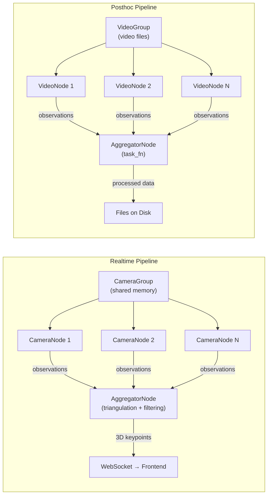

import { AiGeneratedBanner, Tip } from '@freemocap/skellydocs';

<AiGeneratedBanner />

# Pipeline Architecture

Pipelines are the central abstraction of the FreeMoCap backend. A pipeline takes data from sources (cameras or video files), processes it through a chain of nodes, and produces output (3D keypoints, calibration parameters, Blender scenes).

## Two Pipeline Types

| | Realtime | Posthoc |
|---|---|---|
| **Source** | Camera shared memory ring buffers | Video files (OpenCV `VideoCapture`) |
| **Cadence** | Latest frame, drops stale frames | Sequential, processes every frame |
| **Accuracy** | Best-effort (frame dropping is acceptable) | Highest possible (no drops, full dataset) |
| **Lifetime** | Long-lived, bound to camera group | Fire-and-forget, ends when video ends |
| **Dataset access** | Current frame only | Full video (forward/backward, global context) |
| **GPU inference** | Batched centralized node (optional) | Inline per video node |
| **Output** | WebSocket → frontend (streaming) | Files on disk → playback |



## Abstract Base Classes

All pipeline components inherit from a shared set of ABCs in `core/pipeline/abcs/`.

### BaseNode

Every node in a pipeline (source or aggregator) extends `BaseNode`. It provides:

- **Lifecycle**: `start()` spawns a child process via `ManagedWorker`; `shutdown()` signals it to stop; `is_alive` checks if the process is still running
- **Shutdown signal**: Each node holds a `shutdown_self_flag` (`multiprocessing.Value('b', False)`, a synchronized bool) checked in its main loop
- **Global kill**: Nodes also check `global_kill_flag` — the nuclear option that stops everything
- **Windows spawn staggering**: 0.25s delay between child process starts to avoid `spawn` mode race conditions

### SourceNode and AggregatorNode

Marker ABCs that distinguish the two node roles. `SourceNode` produces observations (camera frames, video frames). `AggregatorNode` consumes them and produces final output.

### PipelineABC and PipelineManagerABC

Marker ABCs for pipelines and their managers. These exist for type clarity rather than shared behavior — the realtime and posthoc implementations diverge significantly.

### PipelineIPC

Shared IPC primitives owned by each pipeline:

| Field | Purpose |
|---|---|
| `pipeline_id` | Unique identifier |
| `pipeline_shutdown_flag` | Stops this pipeline only |
| `global_kill_flag` | Shared reference to the global kill switch |
| `heartbeat_timestamp` | Last heartbeat from each child node |
| `ws_queue` | Queue for messages destined for the WebSocket |

The `should_continue` property checks all three stop conditions: `not global_kill_flag.value and not pipeline_shutdown_flag.value and check_main_process_heartbeat(...)`. This ensures nodes stop if either the global kill switch is triggered, their pipeline is shut down, or the main process has died.

Two shutdown authorities:
- `shutdown_pipeline()` — stops this pipeline, leaves everything else running
- `kill_everything()` — sets both pipeline shutdown AND global kill flags (nuclear option, used when a CameraNode crashes)

## Realtime Pipeline

The realtime pipeline streams live camera data, processes it frame-by-frame, and sends results to the frontend over WebSocket. It's designed for **low latency** — the latest frame is always processed, and stale frames are dropped.

### Topology

```
CameraGroup (shared memory ring buffers, one per camera)
    │
    ▼
CameraNodes (one child process per camera)
    │ Reads from ring buffer, blocks on ProcessFrameNumberTopic
    │ Runs CharUcoDetector and RTMPoseDetector inline
    │ Publishes CameraNodeOutputMessage per frame
    │
    ▼  (optionally)
RealtimeSkeletonInferenceNode (centralized GPU, optional)
    │ Batched ONNX inference across all cameras
    │ Drains to latest frame (drops stale frames)
    │ Publishes SkeletonInferenceResultMessage
    │
    ▼
RealtimeAggregatorNode (child process)
    │ Collects per-camera observations for current frame
    │ If calibration valid: triangulates (DLT) → filters → outputs
    │ Publishes AggregationNodeOutputMessage
    │
    ▼
RealtimePipeline.get_latest_frontend_payload() (main process)
    │ Called by WebSocket relay
    │
    ▼
WebSocket → Frontend
```

### CameraNode (`camera_node.py`, ~258 lines)

Each camera gets its own child process running a `CameraNode`:

1. **Reads frames** from the camera's `CameraSharedMemoryRingBuffer` (shared memory, no copy)
2. **Blocks on `ProcessFrameNumberTopic`** — the aggregator tells it which frame to process (up to 5ms timeout)
3. **Runs detectors inline**: `RTMPoseDetector` for skeleton, `CharucoDetector` (from skellytracker) for calibration markers
4. **Applies image rotation** from camera metadata (if the camera is physically rotated)
5. **Verifies frame_number** matches the requested frame — detects ring buffer overwrites (camera writing faster than pipeline reads)
6. **Publishes `CameraNodeOutputMessage`** per frame (observations + metadata)
7. **On exception**: calls `ipc.kill_everything()` — the nuclear option. A camera node crash means the pipeline can't produce valid output, so everything stops.

In **centralized GPU mode**, CameraNodes skip skeleton detection — the `RealtimeSkeletonInferenceNode` handles it separately.

### RealtimeSkeletonInferenceNode (`realtime_skeleton_inference_node.py`, ~435 lines)

Optional dedicated GPU worker for batched ONNX inference. When enabled:

1. **One CUDA context, one `RTMPoseSession`** — avoids per-node GPU context switching overhead
2. **Subscribes to `ProcessFrameNumberTopic`**, drains to the latest frame (drops stale frames when GPU falls behind)
3. **Reads images directly** from per-camera ring buffers (read-only, no copy)
4. **Calls `session.predict_batch(images)`** — one ONNX `session.run` per multi-camera frame
5. **Publishes `SkeletonInferenceResultMessage`** — per-camera skeleton observations keyed by frame_number
6. **GPU OOM recovery**: catches `MemoryError`, rebuilds session (up to 3 retries), skips the affected frame
7. **TensorRT engine compilation** available when configured with execution provider `"trt"` (1–3 minutes on first run, cached on subsequent runs). The default execution provider is `"cuda"`.

### RealtimeAggregatorNode (`realtime_aggregator_node.py`, ~621 lines)

The aggregator is where the real work happens. It runs as a child process:

1. **Owns a `CalibrationStateTracker`** for hot-reloadable calibration (loads on creation, polls for changes when called)
2. **Collects `CameraNodeOutputMessage`** from all cameras (blocks up to 5ms per camera)
3. **In GPU mode**: waits for `SkeletonInferenceResultMessage`, splices per-camera skeletons into camera outputs
4. **Optimistically requests next frame** before processing the current one (parallelism: cameras work on frame N+1 while aggregator processes frame N)
5. **Triangulation**: DLT via `calibration.try_angulate()` (which uses the `Triangulator` class internally), reprojection error gating
6. **Filtering pipeline**: `SimpleRealtimeKeypointFilter` (OneEuro on raw) → `RealtimePointGate` (velocity check) → `RealtimeSkeletonFilter` (OneEuro + FABRIK bone constraint)
7. **All processing in `dict[str, ndarray]`** until final `Point3d` conversion (avoids per-point object overhead)
8. **Backpressure**: `result_ready_event` / `result_consumed_event` pair — the aggregator waits for the main process to consume the previous result before producing the next one

### RealtimePipelineManager (`realtime_pipeline_manager.py`, ~156 lines)

- Maintains `pipelines: dict[PipelineIdString, RealtimePipeline]`
- **One pipeline per camera group** (singleton by camera ID set)
- `wait_for_any_result_ready()`: concurrent `asyncio.to_thread(event.wait)` across all alive pipelines
- `pause_unpause_all()`: toggles all camera groups
- Thread-safe via `multiprocessing.Lock`

## Posthoc Pipeline

The posthoc pipeline processes recorded videos offline. It's designed for **accuracy** — every frame is processed sequentially, the full dataset is available, and the output is written to disk.

### Topology

```
VideoGroup (set of synchronized video files on disk)
    │
    ▼
VideoNodes (one child process per video)
    │ Reads frames sequentially via OpenCV VideoCapture
    │ Runs detector from config (CharUco, MediaPipe, RTMPose)
    │ Optionally produces annotated video output
    │ Reports progress per frame
    │ Publishes VideoNodeOutputMessage per frame
    │
    ▼
PosthocAggregatorNode (child process)
    │ Collects observations from all video nodes
    │ Runs task_fn (calibration or mocap logic)
    │ Writes output artifacts to disk
    │ Reports progress
    │
    ▼
Output files on disk → Playback via REST API
```

### VideoNode (`video_node.py`, ~340 lines)

Each video gets a child process:

1. **Reads frames** via OpenCV `cv2.VideoCapture` (sequential, no frame dropping)
2. **Creates detector** from config (any `BaseDetectorConfig` — charuco, mediapipe, RTMPose)
3. **Publishes `VideoNodeOutputMessage`** per frame (detection observations)
4. **Annotated video output**: layers detection annotations on frames
   - Tries H.264 ("avc1") encoder first, falls back to mp4v
   - If existing annotated video exists, layers on top of it (preserves previous annotations)
5. **Progress per frame**: `VideoNodeProgressMessage` at each phase transition
6. **On error**: logs exception, sends FAILED progress, calls `ipc.shutdown_pipeline()` (pipeline-local — does NOT trigger global kill)

### VideoGroupHelper (`video_group_helper.py`, ~581 lines)

Manages the set of video files for a posthoc pipeline:

- **`VideoHelper`**: LRU-cached video reader with frame cache (configurable MB limit), sequential read optimization
- **`VideoMetadata`**: Pydantic model (width, height, fps, frame_count, fourcc, duration)
- **Source resolution**: prefers manifest's `videos` map (authoritative camera_id → filename); falls back to filename parsing with collision detection
- **Validates** all videos have the same frame count

### PosthocPipelineManager (`posthoc_pipeline_manager.py`, ~216 lines)

- `pipelines: dict[PipelineIdString, PosthocPipeline]`
- **Fire-and-forget**: creates pipelines that run to completion independently
- **Lazy dead-pipeline eviction**: drains final progress messages before removing completed/failed pipelines
- `create_calibration_pipeline()`: binds `run_posthoc_calibration_task` via `functools.partial`
- `create_mocap_pipeline()`: binds `run_posthoc_mocap_aggregator_task`
- Each pipeline emits a "queued" progress message before starting workers

## Pipeline Phases & Progress Reporting

Pipeline progress flows from backend to frontend through WebSocket → rAF loop → Redux dispatch. The phase enums must stay in sync with `ServerContextProvider.tsx`.

### VideoNode Phase
```
SETTING_UP → PROCESSING_IMAGES → COMPLETE
                               → FAILED
```

### Aggregator Phase
```
COLLECTING_CAMERA_OUTPUT → COMPLETE
                         → FAILED
```

### Calibration Stage
```
VALIDATING_OBSERVATIONS → RUNNING_SOLVER → SAVING_CALIBRATION
```

### Mocap Stage
```
BUILDING_RECORDERS → TRIANGULATING → EXPORTING_BLENDER
```

### Progress Message Structure

```python
@dataclass
class PipelineProgressMessage:
    message_type: str = "posthoc_progress"
    pipeline_id: str = ""
    pipeline_type: str = ""              # "calibration" or "mocap"
    phase: str = ""                      # Current phase enum value
    progress_fraction: float = 0.0       # 0.0 to 1.0
    detail: str = ""                     # Human-readable status
    recording_name: str = ""
    recording_path: str = ""
```

Video node progress adds `camera_id`. Aggregator progress uses the base message. The frontend groups progress by `pipeline_id` and displays per-stage completion in the pipeline progress panel.

<Tip shortInfo="Progress messages are JSON over WebSocket, not REST. This means the frontend gets live progress without polling. The frontend's rAF loop dispatches them to Redux, which triggers UI updates in the PipelineProgressPanel and PipelineProgressSnackbar components." />

## Additional Pipeline Components

Several pipeline components exist in the codebase without dedicated documentation sections yet:

| Component | File | Lines | Purpose |
|---|---|---|---|
| `RealtimePipeline` | `realtime_pipeline.py` | ~371 | Pipeline dataclass: create, start, shutdown, config update for realtime pipelines |
| `PosthocPipeline` | `posthoc_pipeline.py` | ~221 | Pipeline dataclass: create, start, shutdown for posthoc pipelines |
| `PosthocAggregationNode` | `posthoc_aggregation_node.py` | ~286 | Collects all VideoNode outputs by frame, delegates to task function |
| `CameraNodeConfig` | `camera_node_config.py` | ~25 | Pydantic model for CameraNode configuration |
| `RealtimeAggregatorNodeConfig` | `realtime_aggregator_node_config.py` | ~24 | Pydantic model for AggregatorNode configuration |
| `RealtimePipelineConfig` | `realtime_pipeline_config.py` | ~28 | Pydantic model for RealtimePipeline configuration |
| `RealtimeSkeletonInferenceNodeConfig` | `realtime_skeleton_inference_node_config.py` | ~36 | Pydantic model for SkeletonInferenceNode configuration |
| `PipelineStageTimer` | `pipeline_stage_timer.py` | ~69 | Per-node accumulator for stage timing measurements |
| `PipelineTimingReporter` | `pipeline_timing_reporter.py` | ~291 | Subscribes to timing data, prints consolidated report tables |
| `TaskProgressReporter` | `task_progress_reporter.py` | ~50 | Typed progress-reporting interface for task functions |
| `SimpleRealtimeKeypointFilter` | `realtime_keypoint_filter.py` | ~123 | One Euro filter with gap-filling for realtime keypoints |
