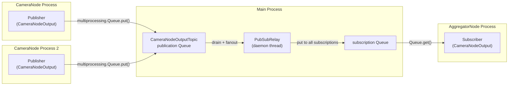

import { AiGeneratedBanner, Tip } from '@freemocap/skellydocs';

<AiGeneratedBanner />

# Pub/Sub System

The pub/sub system is a process-safe topic-based message bus that decouples communication between pipeline nodes running in separate child processes. It's similar in spirit to ROS 2 topics, but custom-built for FreeMoCap's specific needs.

## Why Pub/Sub?

Pipeline nodes run in separate `multiprocessing` child processes. They need to communicate — camera nodes send observations to the aggregator, the aggregator sends frame requests back to camera nodes, config changes need to broadcast to everyone. Direct process-to-process communication would couple node lifetimes and create complex dependency graphs. Pub/sub decouples them: publishers and subscribers never know about each other.

## Architecture



**One relay thread per pipeline** (not global). Each pipeline has its own isolated pub/sub bus with its own `PubSubRelay` daemon thread.

## Core Classes

### TopicMessageABC

Base dataclass for all messages. Subtypes include:

| Message | Carries |
|---|---|
| `ProcessFrameNumberMessage` | `frame_number: int` — which frame to process |
| `PipelineConfigUpdateMessage` | `pipeline_config` — new configuration |
| `CameraNodeOutputMessage` | `camera_id`, `frame_number`, charuco observation, skeleton observation |
| `SkeletonInferenceResultMessage` | `frame_number`, per-camera skeleton observations |
| `VideoNodeOutputMessage` | `camera_id`, `frame_number`, observation |
| `AggregationNodeOutputMessage` | `frame_number`, `pipeline_id`, keypoints (raw + filtered), rigid bodies |
| `PipelineTimingMessage` | `node_kind`, `node_label`, `camera_id`, timing samples |

### PubSubTopicABC[MessageType]

Generic topic class parameterized by message type:

- `publication`: `multiprocessing.Queue` (one per topic, default `maxsize=100`)
- `subscriptions`: list of `multiprocessing.Queue` (subscribers each get their own queue)
- Auto-registration via `__init_subclass__` — topic classes are tracked globally
- `relay_to_subscribers()`: drains the publication queue, fans out to all subscription queues. On `Full`: evicts the oldest message.

Topics are created dynamically:
```python
ProcessFrameNumberTopic = create_topic(ProcessFrameNumberMessage)
CameraNodeOutputTopic = create_topic(CameraNodeOutputMessage)
```

### PubSubRelay

A daemon thread in the main process:

- Polls all topic publication queues every **1ms** when idle
- Distributes each message to all subscribers for that topic
- Holds a subscriptions lock for thread safety (main thread adds subscribers; relay thread iterates them)
- **On fatal error**: sets `global_kill_flag.value = True` — crashes the relay, everything stops
- `drain()`: flushes remaining messages during shutdown (up to 2s timeout)
- `stop()`: signals stop event, joins thread (up to 5s timeout), drains residual messages

### PubSubTopicManager

Created per-pipeline (main process only — enforced by `parent_process()` check):

- Auto-instantiates all registered topic classes
- Starts the relay thread
- `get_subscription(topic_type)` → returns a subscription queue (passed as kwarg to child processes)
- `get_publication_queue(topic_type)` → returns the bare `multiprocessing.Queue` (pickle-safe for children)
- `publish(topic_type, message)` → main-process convenience method for publishing

## Defined Topics (7)

| Topic | Publisher | Subscriber(s) | Queue Size | Purpose |
|---|---|---|---|---|
| `ProcessFrameNumberTopic` | Aggregator | CameraNodes, SkeletonInferenceNode | 100 | "Process frame N" |
| `PipelineConfigUpdateTopic` | Main process | All workers | 100 | Config change broadcast |
| `CameraNodeOutputTopic` | CameraNodes | Aggregator | 100 | Per-camera observations |
| `SkeletonInferenceResultTopic` | SkeletonInferenceNode | Aggregator | 100 | GPU batched skeletons |
| `VideoNodeOutputTopic` | VideoNodes | Aggregator | **Unbounded (0)** | Posthoc observations |
| `AggregationNodeOutputTopic` | Aggregator | Frontend consumer | 100 | Final pipeline output |
| `PipelineTimingTopic` | All nodes | Aggregator | 100 | Per-node timing samples |

<Tip shortInfo="VideoNodeOutputTopic uses an unbounded queue (maxsize=0) because in posthoc pipelines, video nodes finish producing all frames before the aggregator starts consuming. A bounded queue would risk dropping frames that must all be processed." />

## Design Constraints

### Never pickled to children
Bare `multiprocessing.Queue` handles are passed as explicit keyword arguments to child processes. The `PubSubTopicManager` stays in the main process. This avoids pickling complex objects and the associated import-side-effect issues on Windows.

### Pipeline-owned, not global
Each pipeline creates its own `PubSubTopicManager` with its own relay thread and topic set. Pipelines are fully isolated — messages from one pipeline never leak into another.

### Message ordering preserved
`put_nowait()` is used everywhere (non-blocking). Publication queue order is preserved through the relay to subscribers. On `queue.Full`, the oldest message is evicted — meaning a slow subscriber sees the latest data, not stale data.

### Decoupled lifetimes
Publishers can start and stop independently of subscribers. If a CameraNode starts publishing before the AggregatorNode subscribes, messages queue up. If a CameraNode dies, the relay continues distributing messages from other publishers. This is essential for robustness in multi-process pipelines where nodes can crash individually.

### Windows spawn staggering
On Windows, child processes use the `spawn` start method (not `fork`). To avoid race conditions when multiple processes start simultaneously, `BaseNode` adds a 0.25s delay between process starts.

## Shutdown Behavior

1. **Normal shutdown**: `pipeline.shutdown()` sets `pipeline_shutdown_flag`, each node's main loop checks `should_continue` and exits cleanly
2. **Relay drain**: `drain()` flushes any remaining messages in publication queues (up to 2s)
3. **Relay stop**: signals stop event, joins the relay thread (up to 5s timeout)
4. **Nuclear option**: if the relay itself crashes, `global_kill_flag.value = True` — every node in every pipeline sees this and shuts down

## Data Flow: A Frame's Journey

```
1. Aggregator publishes ProcessFrameNumberMessage(frame=42)
        │
2. Relay fans out to all CameraNodes
        │
3. CameraNodes read frame 42 from ring buffer, detect, publish CameraNodeOutputMessage
        │
4. Relay fans out to Aggregator's subscription queue
        │
5. Aggregator collects all camera outputs for frame 42, triangulates, filters
        │
6. Aggregator publishes AggregationNodeOutputMessage
        │
7. Relay fans out to frontend consumer's subscription queue
        │
8. Main process (WebSocket relay) reads AggregationNodeOutputMessage
        │
9. WebSocket → Frontend
```
