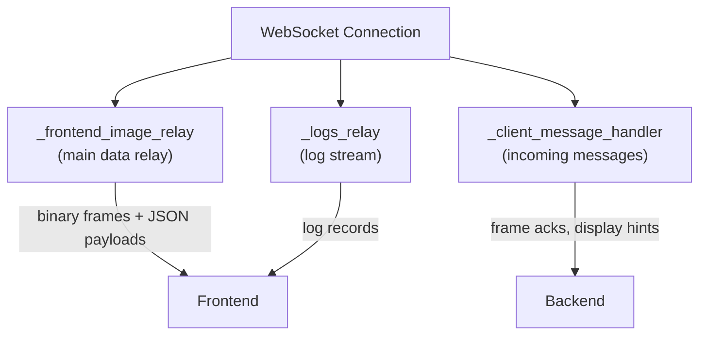

import { AiGeneratedBanner, Tip } from '@freemocap/skellydocs';

<AiGeneratedBanner />

# WebSocket Server

The WebSocket server (`api/websocket/websocket_server.py`, ~377 lines) is the real-time data bridge between the backend pipelines and the frontend. It streams camera frames, keypoints, logs, and progress updates over a single persistent connection.

<Tip shortInfo="The WebSocket server, like the frontend's ServerContextProvider, is larger than it should be. Its responsibilities grew together because they share one WebSocket connection and one event loop. A refactor to break it into focused pieces is planned but deferred — for now, it works." />

## Connection

A single WebSocket endpoint at `ws://localhost:53117/websocket/connect`.

On connection, `websocket_connect.py` creates a `WebsocketServer` instance, enters its context manager, and calls `run()` — which launches three concurrent asyncio tasks.

## Three Concurrent Tasks



### 1. `_frontend_image_relay` — Main Data Relay

This is the core task. It packages data from the running pipelines and sends it to the frontend.

**Priority order each tick:**

1. **Drain posthoc progress messages always** — never gated by backpressure. Progress updates are small and time-sensitive.
2. **Backpressure gate** — waits for frontend acknowledgment (`last_received_frontend_confirmation >= last_sent_frame_number`). If the frontend hasn't confirmed it received the last frame batch, the relay pauses.
   - **WARNING at multiples of 300 unacknowledged frames** — logged as a signal that the frontend may be falling behind (first warning at 600, then every 300 thereafter)
   - **Reset at BACKPRESSURE_RESET_THRESHOLD unacknowledged frames** — to prevent OOM from unbounded queue growth, the relay resets its internal state
3. **Blocks on `wait_for_realtime_result`** — event-driven, up to 0.5s timeout. The realtime pipeline's `result_ready_event` fires when a new frame is processed.
4. **Sends `FrontendPayload`** — JSON via `msgspec` (image metadata, keypoints, rigid bodies, overlay data), plus binary image bytes, plus optional binary keypoints.
5. **Tracks framerate** — computes server framerate from `frame_number` + capture timestamp, and display framerate from WebSocket send rate. Sends `FramerateMessage` at ~4Hz.

**Backpressure design:**

```
Backend produces frame N → sends to frontend
                         → waits for ack (frame number N)
Frontend receives frame N → processes in rAF loop
                          → sends ack (frame number N)
Backend receives ack → allowed to send frame N+1
```

This prevents the backend from flooding the frontend with frames faster than it can render them. The frontend acks the frame number immediately at the top of its rAF loop (before decoding), so the backend can pipeline the next batch while the frontend decodes the current one.

### 2. `_logs_relay` — Log Stream

Reads from the `skellylogs` WebSocket log queue (populated by all child processes via `skellylogs`).

- Filters by minimum log level
- Handles `EOFError` / `OSError` from dying child processes gracefully (logs the error, continues)
- Logs appear in the frontend's `LogTerminal` component

### 3. `_client_message_handler` — Incoming Messages

Processes messages from the frontend:

| Message key | Purpose |
|---|---|
| `frameNumber` | Updates `last_received_frontend_confirmation` — the backpressure ack |
| `displayImageSizes` | Stores overlay scaling hints (pixels per camera) |
| `websocket.disconnect` | Triggers clean server-side shutdown |
| `ping` | Responds with `pong` (heartbeat) |

## Message Types

### Outgoing (Server → Client)

| Type | Format | Content |
|---|---|---|
| `FRONTEND_PAYLOAD` | JSON (`msgspec`) + binary attachments | Image metadata, keypoints, rigid bodies, overlay data, plus binary JPEG frames and optional binary keypoints |
| `FRAMERATE_UPDATE` | JSON (`msgspec`) | Server FPS (from frame timing) and display FPS (from WebSocket send rate) |
| `POSTHOC_PROGRESS` | JSON (`msgspec`) | Pipeline progress (pipeline_id, phase, progress_fraction, detail) |
| `LOG_RECORD` | JSON | Server logs (level, message, timestamp) |
| `TRACKER_SCHEMAS` | JSON (`msgspec`) | Sent once on connect: keypoint names and connections for the active tracker |

### Incoming (Client → Server)

| Message key | Purpose |
|---|---|
| `frameNumber` | Backpressure acknowledgment |
| `displayImageSizes` | Per-camera display dimensions for overlay scaling |
| `ping` | Heartbeat |

## Binary Keypoints Protocol

The WebSocket server supports an optional binary keypoints wire format (`api/websocket/binary_keypoints_protocol.py`, ~124 lines) gated behind an environment variable. When enabled, 3D keypoints are sent as structured binary messages instead of JSON, providing significantly lower serialization overhead for high-frequency skeleton data.

The binary format uses a multi-part message structure:
- **Payload Header** (24 bytes): message_type, frame_number, num_blocks
- **Per-block**: Block Header (44 bytes) with block_kind, dtype_code, dims, camera_id, tracker_id, num_points, data_byte_length — followed by interleaved x/y(/z)/visibility per point in row-major order
- **Payload Footer** (24 bytes): mirrors header

See the [API Boundary](./api-boundary) page for the full binary message format specification.

## Serialization

Uses `msgspec.json.Encoder` with a custom `enc_hook` that handles:

- **Pydantic models**: calls `model_dump()`
- **Dataclasses**: calls `dataclasses.asdict()`
- **NumPy scalars**: converts to Python native types (`float()`, `int()`)
- **NumPy arrays**: converts to lists

A send lock (`asyncio.Lock`) prevents concurrent writes to the same WebSocket connection from the three concurrent tasks.

## Tracker Schemas

On connection, the server sends `TrackerSchemasMessage` containing every active tracker's `TrackerDefinition` — e.g. `rtmpose_wholebody`, `mediapipe_wholebody`, and the canonical body/hand schemas (`collect_active_tracker_schemas()`). This tells the frontend:
- What keypoints exist (names and indices)
- How keypoints connect (skeleton lines to draw)
- Without hardcoding any skeleton topology in the frontend

The frontend uses this to render the 3D skeleton in the Three.js viewport and the 2D overlays on camera feeds.

## Current State & Future Direction

At 377 lines with three concurrent tasks, the WebSocket server is approaching the size where it would benefit from being split into focused modules:

- Connection lifecycle management (connect, disconnect, heartbeat, reconnect)
- Frame relay (backpressure, binary serialization, framerate tracking)
- Log relay (log filtering, child process error handling)
- Message routing (type discrimination, handler dispatch)

This refactor is planned but deferred. The current implementation works correctly — it just needs modular boundaries before it grows further.
