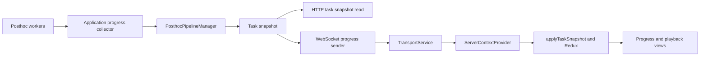

import { AiGeneratedBanner } from '@freemocap/skellydocs';

<AiGeneratedBanner generatedAt="2026-09-10" humanCurated={false} />

# Frontend/backend communication

**Source audit: 2026-09-10.** This page describes the inspected communication and
posthoc-progress paths. It does not establish a public SDK contract or certify all
endpoint retry behavior. See the [architecture review](../work-plans/architecture-review.md)
for proposed principles, gaps, and decisions requiring review.

## Transport topology

| Transport | Current use | Lifetime owner |
| --- | --- | --- |
| HTTP | Commands, state reads, playback metadata/data and video delivery | Request handlers; long-running processing is owned by application managers |
| WebSocket `/websocket/connect` | Live frames/images, application state, progress, logs and framerate | One TransportService connection per mounted provider; one WebsocketServer per accepted connection |
| Electron IPC | Desktop integration | Electron bridge and main process; not traced in this audit |

Playback uses HTTP. There is no separate playback WebSocket in this path.
Application and realtime traffic share the WebSocket connection.

## Client responsibilities

`TransportService` owns `WebSocketConnection`. It decodes binary CBOR, validates the
message contract, and dispatches by `kind`. It does not import React or Redux.

`ServerContextProvider` creates the transport in an effect and subscribes to its
outputs. It connects those outputs to Redux, frame/image processing, overlays,
canvases, framerate storage, and logs. Its cleanup unsubscribes, disconnects, and
disposes owned rendering resources. On disconnected/failed states, it clears held
presentation data, resets transport caches, and dispatches `serverDisconnected`.

| Message kind | Client destination |
| --- | --- |
| `frame` | Resolve channels; publish points/models/overlays/images and diagnostics; reconcile model, camera, and convention caches by content |
| `app_state` | Dispatch `serverStateReceived` |
| `progress` | Apply the complete task snapshot through `applyTaskSnapshot` |
| `log` | Log subscribers and LogStore |
| `framerate` | Framerate subscribers and FramerateStore |

Frame/channel dispatch happens on message arrival. Image decoding and rendering
have their own scheduling in the provider; the complete stream is not dispatched
through a single requestAnimationFrame JSON queue.

The transport logs subscriber exceptions and continues fan-out. Unknown kinds or
unsupported versions are skipped with a warning. These are observed policies,
not an endorsement of the intended error contract.

## Server responsibilities

`WebsocketServer.run` starts connection-owned tasks for the live relay, logs,
inbound messages, application state, and posthoc progress. They share a serialized
writer. When a task ends, the runner cancels and awaits its remaining tasks.

The application-state sender checks state every second and publishes initially and
when the state changes. The progress sender publishes a full task snapshot every
half-second. These intervals describe current code, not transport guarantees.

The application lifespan separately runs `collect_task_progress`. It calls the
pipeline manager's `refresh_progress` in a thread every half-second, including when
no client is connected. WebSocket readers do not consume those worker progress queues.
A collector exception records a fatal error and sets the application kill flag.
Connection-local runner errors use the connection continuation flag.

## Task snapshot and reconciliation

| Scope | Included information |
| --- | --- |
| Registry | Server instance UUID, revision, complete retained task collection, recording owners |
| Task | ID, revision, type, RecordingStructure, status, progress, camera nodes, creation/update times |
| Progress | Phase, nullable fraction, detail |
| Camera node | Node ID, camera ID, progress |

The Python task model uses the existing `RecordingStructure`. Its serialized client
representation contains `base_directory`, `recording_name`, and `full_path` strings.
Wire strings do not imply that the Python domain model uses an unvalidated raw path.

The reducer ignores equal/older revisions for the same server instance, replaces
its task collection on acceptance, and updates recording ownership. A changed
server instance resets the client dismissal list.

`applyTaskSnapshot` also invalidates playback while a recording is owned. It compares
previous owners and task phases to trigger playback reloads and calibration reloads
when processing finishes. Rendering a snapshot and triggering these refresh side
effects are separate behaviors; the latter explicitly consults previous client state.

## Completed tasks and dismissal

The server registry currently retains up to 100 completed tasks after pruning,
excluding tasks that remain active in the manager. The client keeps dismissed task
IDs and persists them under `pipelines.dismissals`. Hiding a task does not remove it
from server membership.

This behavior differs from the agreed dismissal requirement. The
[architecture review](../work-plans/architecture-review.md#2-define-completed-task-lifetime)
keeps that discrepancy explicit rather than presenting it as a desired contract.

## Source map

Paths below are relative to the `freemocap` repository root. Symbols identify the
inspected implementation; the audit is tied to the source on disk, not a moving
external branch link.

| Source path | Relevant symbols |
| --- | --- |
| `freemocap-ui/src/services/server/transport/TransportService.ts` | `dispatchBytes`, `handleFrame`, `updateStaticModel`, `fanOut` |
| `freemocap-ui/src/services/server/transport/message-contract.ts` | Message schemas, `TaskRegistrySnapshotSchema` |
| `freemocap-ui/src/services/server/ServerContextProvider.tsx` | Effect subscriptions, connection-state handler, cleanup, `handleProgress` |
| `freemocap-ui/src/services/server/task-progress.ts` | `applyTaskSnapshot` |
| `freemocap-ui/src/store/slices/pipelines/pipelines-slice.ts` | `taskSnapshotReceived`, dismissal reducers, initial storage read |
| `freemocap-ui/src/store/persistence-listener.ts` | Dismissal persistence |
| `freemocap/app/app.py` | `collect_task_progress`, `app_lifespan` |
| `freemocap/api/websocket/websocket_server.py` | `run`, `_app_state_sender`, `_posthoc_progress_sender` |
| `freemocap/api/websocket/send_serializer.py` | Serialized WebSocket writer |
| `freemocap/core/pipeline/posthoc/posthoc_pipeline_manager.py` | `refresh_progress`, `task_snapshot`, `stop_pipeline` |
| `freemocap/core/pipeline/posthoc/task_snapshot.py` | `TaskSnapshot`, `TaskRegistry`, `prune_completed` |
| `freemocap/api/http/posthoc/tasks_router.py` | Snapshot GET handler |
| `freemocap/api/http/playback/playback_router.py` | Media, manifest, window, bundle, and video handlers |

## Audit limits

This is a source inspection, not an application test. It does not yet trace every
HTTP mutation, all device behavior, log queue ownership, Electron IPC, or every
consumer of server state. The other architecture pages may still describe different
contracts and remain pending reconciliation in the
[disposition register](../work-plans/disposition.md).
