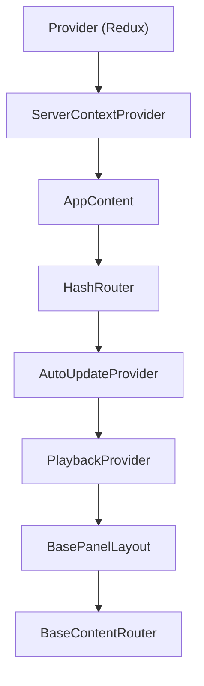
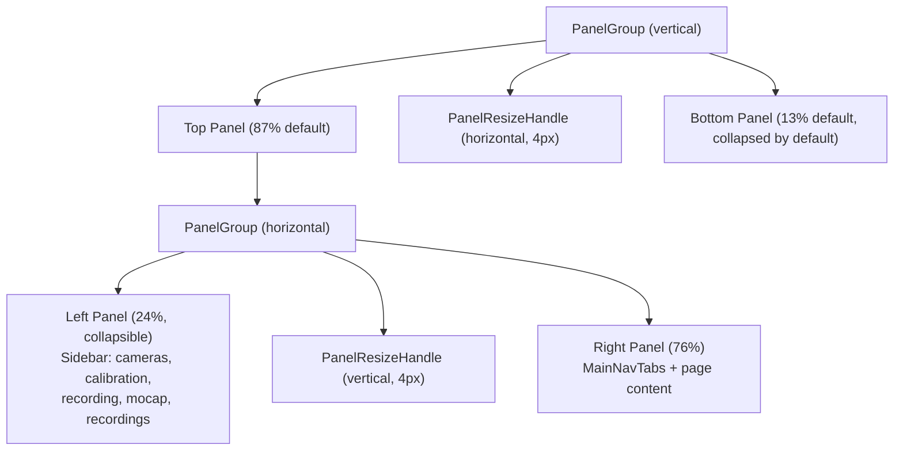

import { AiGeneratedBanner, Tip } from '@freemocap/skellydocs';

<AiGeneratedBanner />

# Frontend Component Architecture

The frontend is a React 19 + TypeScript application rendered inside Electron (or a browser for development). It uses `HashRouter` for routing, `react-resizable-panels` for layout, and Redux Toolkit for state management.

## Entry Point & Provider Hierarchy

The app boots from `main.tsx` and nests providers in a deliberate order. Order matters — inner providers can depend on outer ones.

```
main.tsx
  React.StrictMode
    App (src/app/App.tsx)
      Provider (Redux store)              ← must be outermost: everything reads Redux
        ServerContextProvider              ← WebSocket, frames, keypoints, logs
          AppContent (src/app/AppContent.tsx)
            HashRouter                     ← routing depends on ServerContext
              AutoUpdateProvider           ← Electron auto-updater state
                PlaybackProvider           ← loaded videos, timestamps, sources
                  BasePanelLayout          ← the three-panel layout
                    BaseContentRouter      ← route → page mapping
```



## Routing Design

### Why HashRouter

The app uses `HashRouter` (URLs look like `/#/streaming`) instead of `BrowserRouter` (`/streaming`). Reason: Electron loads the app via `file://` protocol. A `BrowserRouter` would try to request `/streaming` from the filesystem, which doesn't work. HashRouter keeps everything client-side.

### Route Table

Defined in `src/layout/content/BaseContentRouter.tsx`:

| Path | Page | Purpose |
|---|---|---|
| `/` | Redirect to `/streaming` | Root |
| `/streaming` | `StreamingViewPage` | Live camera grid + optional 3D viewport |
| `/browse` | Redirect to `/playback` | Legacy redirect |
| `/playback` | `PlaybackPage` | Synced multi-video playback + 3D skeleton viewer |
| `/active-recording` | `ActiveRecordingPage` | Pipeline stage status + processing controls |
| `*` | Redirect to `/streaming` | Catch-all |

### Navigation

Navigation happens three ways:

1. **`MainNavTabs`** — Segmented control in the header bar. Uses `react-router-dom`'s `useNavigate()` to switch routes.
2. **Programmatic** — Buttons within pages call `navigate()` directly (e.g., "Go to Playback" from the recording complete dialog).
3. **Electron native menus** — `useMenuActions` hook bridges Electron's native menu bar actions to React-Redux, calling `navigate()` for menu items like "Switch to Playback."

## Layout System

### BasePanelLayout

The top-level layout component (`src/layout/BasePanelLayout.tsx`) uses `react-resizable-panels` to create a three-panel design:



- **Top panel** (87% default): Sidebar on the left, main content on the right, divided by a vertical resize handle.
- **Bottom panel** (13% default, starts collapsed): Console area with framerate viewer and log terminal.
- Both sidebars are **collapsible** — they shrink to a narrow strip that can be clicked to re-expand.

### Sidebar (Left Panel)

The left sidebar (`SidePanelContent`) is a vertical stack of collapsible sections. Sections are **conditionally visible** depending on which tab is active:

| Section | Visible on tab |
|---|---|
| Camera Config Tree | Streaming only |
| Calibration Module | All tabs |
| Recording Path | Streaming only |
| Recording Control | Streaming only |
| Process Mocap | Playback, Active Recording |
| Mocap Panel | All tabs |
| Recording Browser | Playback, Active Recording |

<Tip shortInfo="The sidebar visibility logic is defined in SidePanelContent.tsx with two restriction sets: STREAMING_ONLY_SECTIONS (cameras, recording_path, recording_control) and PLAYBACK_ONLY_SECTIONS (recordings, process_mocap). Any section not in either set appears on all tabs." />

<Tip shortInfo="The sidebar sections are static (not drag-reorderable). The old MUI-based UI used @dnd-kit for drag-and-drop reordering — this was removed in the new UI for simplicity." />

### Bottom Console

The bottom panel (`BottomPanelContent`) shows different content depending on the active tab:

- **Streaming / Active Recording tabs**: Framerate viewer (D3 charts) on the left, log terminal on the right
- **Playback tab**: Log terminal fills the space

## Page Components

### StreamingViewPage

The main workspace. Shows live camera feeds in a responsive grid (`CameraViewsGrid`) with optional 3D viewport (`ThreeJsCanvas`). The camera grid uses `react-grid-layout` for drag-to-reorder and resize. Each camera tile is a `<canvas>` element rendered by the `CanvasManager` service — not a `<video>` element.

### PlaybackPage

Synced multi-video playback with a companion 3D skeleton viewport. The `SyncedVideoPlayer` component loads recordings and plays them with frame-perfect synchronization using a rAF-based drift-correction loop. A `RecordingBrowser` section in the sidebar lets you browse and select recordings.

### ActiveRecordingPage

Shows the currently active recording's status: which pipeline stages are complete, what data is available, and controls for processing (calibrate, process mocap, export to Blender).

## Component Patterns

### Context vs Redux vs Refs — The Decision Tree

This is the most important architectural decision in the frontend. Putting data in the wrong place causes bugs that are hard to diagnose.

| Mechanism | Use when | Don't use when |
|---|---|---|
| **Redux** | Config that survives navigation; anything persisted to localStorage; cross-cutting UI state that multiple unrelated components read | Rapidly-changing data (60fps); data only needed by one subtree |
| **React Context** | Shared state for a specific subtree (playback, auto-update); avoiding prop drilling through 3+ levels | Global state that many slices need (use Redux); hot-path data (use refs) |
| **useRef** | Data that changes at frame rate: camera frames, keypoints, rigid body poses, overlay data | State that should trigger re-renders when it changes |

<Tip shortInfo="The key insight: refs don't trigger re-renders. Redux does. If you put 60fps keypoint data in Redux, every component that selects from it re-renders 60 times per second. That's a performance disaster. The ServerContextProvider uses refs for all streaming data and only dispatches to Redux for slow-changing state like connection status and pipeline progress." />

### Subscription Pattern

3D data (keypoints, rigid bodies) uses a **Set-based subscription pattern** in `ServerContextProvider`. Consumers register a callback via `subscribeToKeypointsRaw()`, `subscribeToKeypointsFiltered()`, or `subscribeToRigidBodies()`. When new data arrives on the WebSocket, the rAF loop iterates the subscriber Set and calls each callback. This avoids React re-renders entirely — the Three.js scene updates directly.

### rAF-Driven Processing Loop

The `ServerContextProvider` runs a `requestAnimationFrame` loop rather than processing WebSocket messages as they arrive. Why:

- **WebSocket messages can storm** — dozens of binary frames per tick from multiple cameras
- **Promise-based processing would starve the main thread** — each `await` yields, and a storm of messages means you never finish processing one before the next arrives
- **rAF gives you one tick per frame** — you process all queued messages, then render, then wait for the next frame

The loop structure:
1. Ack the latest frame number (tells the backend it can pipeline the next batch)
2. Dispatch any buffered JSON payloads (keypoints, overlays, rigid bodies, logs, progress)
3. Decode binary image frames asynchronously (never blocks the loop)
4. Measure frontend framerate from decoded frame inter-arrival times

## Anti-Patterns & Pitfalls

### Don't put frame data in Redux

Frame payloads arrive 30+ times per second per camera. Dispatching each one to Redux would cause render storms. Use refs in ServerContextProvider instead.

### Don't read from Redux in the rAF loop

The rAF loop runs at display refresh rate. Reading from Redux selectors inside it creates garbage collection pressure and can cause stale reads. Cache what you need before the loop starts.

### Don't add a new state path without deciding: Context, Redux, or ref?

Every new piece of state needs a conscious decision. The rule of thumb:
- Survives navigation? → Redux
- Only needed by a subtree? → Context
- Changes at frame rate? → ref

### ServerContextProvider: current state, not end state

At ~700 lines, `ServerContextProvider.tsx` is larger than it should be. Its responsibilities (WebSocket, frame processing, canvas management, overlay compositing) are tightly coupled — they share a single WebSocket connection and a single rAF loop — which is why they've grown together. This is accepted as the current state, but it's not the target architecture. The next obvious step is to break it into focused pieces (connection management, frame pipeline, overlay system) with clear interfaces. That refactor is planned but deferred — for now, the monolith works.

## Directory Map

```
src/
├── app/               Entry points
│   ├── App.tsx            Provider + ServerContextProvider wrapper
│   ├── AppContent.tsx     HashRouter + providers + BasePanelLayout + BaseContentRouter
│   └── App.css            Top-level app styles
│
├── layout/            Panel layout and routing
│   ├── BasePanelLayout.tsx       Three-panel resizable layout
│   └── content/
│       ├── BaseContentRouter.tsx  Route definitions
│       ├── SidePanelContent.tsx   Left sidebar with section stack
│       └── BottomPanelContent.tsx Bottom console (framerate + logs)
│
├── pages/             Top-level page components
│   ├── StreamingViewPage.tsx     Live camera grid + 3D viewport
│   ├── PlaybackPage.tsx          Synced video + 3D skeleton viewer
│   └── ActiveRecordingPage.tsx   Pipeline status + processing controls
│
├── components/        Shared and domain components
│   ├── camera-views/             Camera grid display
│   ├── control-panels/           Sidebar panels (camera-config-panel, mocap-control-panel, recording-info-panel, realtime-panel, server-connection)
│   ├── framerate-viewer/         D3 framerate charts (timeseries, histogram, statistics)
│   ├── languages/                LanguageSwitcher + custom flag icons
│   ├── mocap-setup/              Mocap setup wizard (blender settings, detector settings, 3D reconstruction, processing directory, setup modal)
│   ├── playback/                 PlaybackContext, SyncedVideoPlayer, RecordingBrowser, PlaybackControls, RecordingBrowserSection, ZoomableVideoTile, usePlaybackController
│   ├── pipeline-progress/        PipelineProgressPanel, PipelineProgressBar, PipelineProgressSnackbar, PipelineGroupCard, calibration-progress/, realtime/
│   ├── viewport3d/               Three.js scene, renderers, hooks, workers
│   ├── log-terminal/             Scrollable server log viewer
│   ├── ui-components/            Design-system components (Button, Header, Footer, Toggle, SegmentedControl, etc.)
│   └── common/                   ErrorBoundary, DirectoryStatusPanel, PresetPicker, CollapsibleSidebarSection, CalibrationTomlPicker, RecordingStatusPanel
│
├── services/          Backend communication
│   ├── server/
│   │   ├── ServerContextProvider.tsx  WebSocket lifecycle, rAF loop, frame processing, overlays
│   │   ├── server-context.ts         ServerContext interface + useServer hook
│   │   └── server-helpers/           canvas-manager, frame-processor, image-overlay, log-store, websocket-connection, console-log-bridge, framerate-store, offscreen-renderer.worker, tracked-object-definition, websocket-message-types
│   └── electron-ipc/                  tRPC proxy over Electron IPC
│
├── store/             Redux state management
│   ├── store.ts                 configureStore (13 slices, 2 middleware)
│   ├── hooks.ts                 useAppDispatch, useAppSelector (typed)
│   ├── types.ts                 Shared store types
│   ├── persistence.ts           localStorage load/save helpers
│   ├── persistence-listener.ts  Auto-persist middleware (300ms debounce)
│   ├── camera-config-listener.ts Auto-apply camera config middleware (350ms debounce)
│   └── slices/                  One directory per slice (13 total, includes theme slice)
│
├── styles/            CSS utility classes and design tokens
│   ├── App.css                  Master import file + utility classes
│   ├── color.css                Design tokens (CSS custom properties)
│   ├── icons.css                Icon class definitions
│   ├── animation.css            Keyframe animations
│   └── (domain-specific .css files)
│
├── hooks/             Custom React hooks
├── i18n/              Internationalization (i18next, 41 locales)
├── types/             Shared TypeScript types
├── utils/             Pure utility functions
├── constants/         URLs, external links
└── assets/            SVG icons (92 icons)
```
