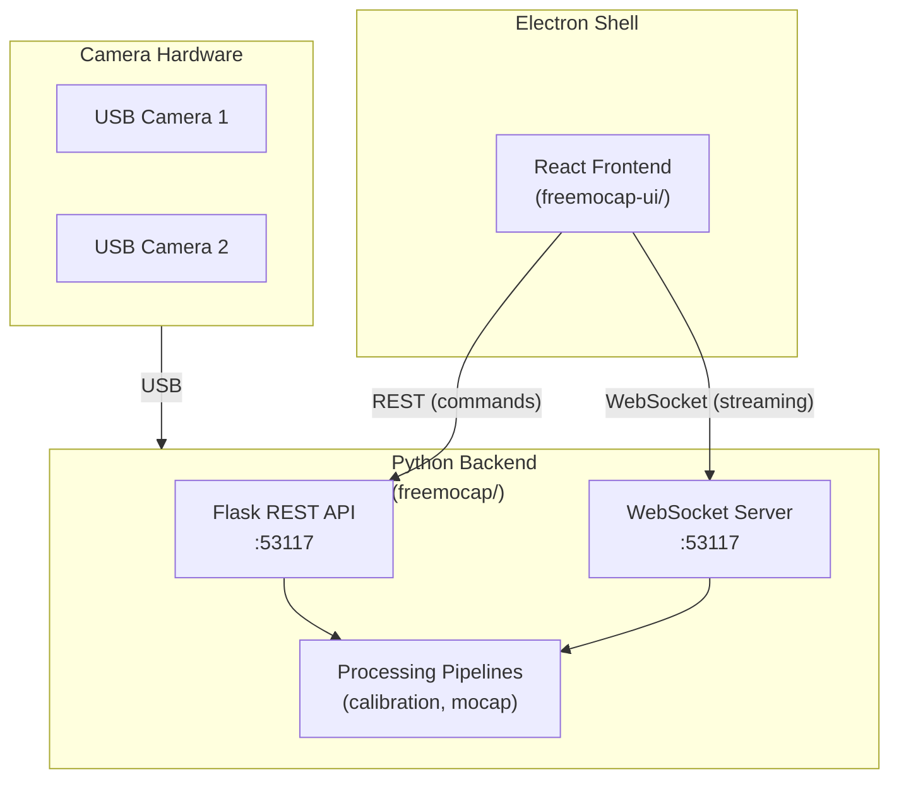
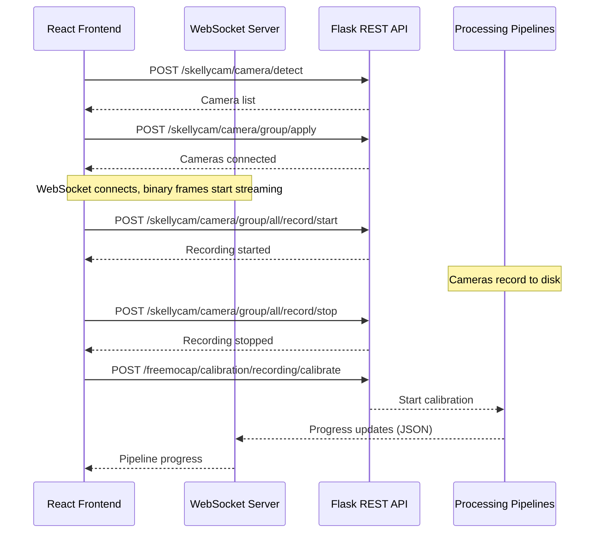

import { AiGeneratedBanner, Tip } from '@freemocap/skellydocs';

<AiGeneratedBanner />

# Architecture Overview

FreeMoCap is a markerless motion capture system. A React/Electron desktop UI talks to a Python backend over REST and WebSocket, streaming live multi-camera video, recording synchronized footage, and processing it into 3D skeleton data.

This page gives you the system-level picture. The pages that follow zoom into each layer — frontend, API boundary, and backend — so you can drill to whatever depth you need.

## System Diagram



Two communication channels between frontend and backend:

- **REST API** (`localhost:53117`) — Commands: detect cameras, start/stop recording, run calibration, process mocap, export to Blender. HTTP request/response.
- **WebSocket** (`localhost:53117/websocket/connect`) — Streaming data: live camera frames (binary JPEG), keypoints, logs, framerate stats, pipeline progress. Persistent connection with auto-reconnect.

There's also **Electron IPC** for desktop-specific operations (file system dialogs, native menus, auto-updater) via a tRPC proxy — but the core system works in a browser too.

## Repository Map

```
freemocap/
├── freemocap-ui/          React/TypeScript frontend (Electron desktop app)
│   └── src/
│       ├── app/            Entry points (main.tsx, App.tsx, AppContent.tsx)
│       ├── layout/         Panel layout + routing (BasePanelLayout, BaseContentRouter)
│       ├── pages/          Top-level page components
│       ├── components/     Shared + domain components
│       ├── services/       Backend communication (WebSocket, REST, Electron IPC)
│       ├── store/          Redux state management (12 slices)
│       ├── styles/         CSS utility classes + design tokens
│       ├── hooks/          Custom React hooks
│       ├── i18n/           Internationalization (40 locales)
│       ├── types/          Shared TypeScript types
│       ├── utils/          Pure utility functions
│       └── constants/      URLs, external links
│
├── freemocap/             Python backend (Flask, WebSocket, processing pipelines)
│
├── freemocap-docs/        This documentation site (Docusaurus v3 + SkellyDocs)
│
├── shared/                Code shared across layers
│
└── freemocap-ui-old/      Previous MUI-based frontend (superseded)
```

<Tip shortInfo="The old UI (freemocap-ui-old/) still exists in the repo but is no longer developed. See the Old vs New Comparison page for what changed." />

## Communication Flow



## Design Philosophy

These principles shape every decision in the codebase. They're non-negotiable.

### Depth-Stackable Complexity

Everything in FreeMoCap should be approachable for a newcomer while exposing full power for experts. The UI defaults to sensible paths, but advanced controls are never hidden — just organized so you find them when you need them.

This documentation follows the same rule. Every page starts with a summary you can read in 30 seconds. Keep scrolling and you hit full implementation detail.

### Fail Loudly

No fallbacks. No silent degradation. No `try: do_thing(); except: do_other_thing()`. If something that should work doesn't work, the system crashes with a clear error message. This surfaces bugs immediately instead of papering over them.

The only valid error handling is at system boundaries: user input validation, external API responses.

### Single Source of Truth

Every decision — backend selection, config flag, feature toggle — has exactly one definition. No duplicated boolean flags. No config keys defined in two places that can drift out of sync. The architecture docs tell you where the canonical location is.

### Zero Backwards Compatibility

There is exactly one version of this code: the current one. Old code is deleted. Old interfaces are broken. Old callers are updated. No deprecation shims, no feature flags to preserve old behavior, no migration layers.

## Quick Reference

### Which file owns what?

| Concern | Canonical location |
|---|---|
| App entry point | `freemocap-ui/src/main.tsx` |
| Provider hierarchy + routing | `freemocap-ui/src/app/AppContent.tsx` |
| Panel layout | `freemocap-ui/src/layout/BasePanelLayout.tsx` |
| Route definitions | `freemocap-ui/src/layout/content/BaseContentRouter.tsx` |
| Redux store config | `freemocap-ui/src/store/store.ts` |
| WebSocket + frame processing | `freemocap-ui/src/services/server/ServerContextProvider.tsx` |
| REST API endpoints | `freemocap-ui/src/constants/server-urls.ts` |
| CSS design tokens | `freemocap-ui/src/styles/color.css` |
| CSS utility classes | `freemocap-ui/src/styles/App.css` |
| i18n configuration | `freemocap-ui/src/i18n/i18n.ts` |

### Ports and URLs

| What | Default |
|---|---|
| Backend HTTP | `http://localhost:53117` |
| Backend WebSocket | `ws://localhost:53117/websocket/connect` |
| Production domain | `https://freemocap.org` |

### Key dependencies (frontend)

| Package | Purpose |
|---|---|
| `react` / `react-dom` | UI framework |
| `@reduxjs/toolkit` / `react-redux` | State management |
| `react-router-dom` | Client-side routing (HashRouter) |
| `react-resizable-panels` | Draggable panel layout |
| `react-grid-layout` | Camera grid with drag-to-reorder |
| `three` / `@react-three/fiber` | 3D skeleton viewport |
| `d3` | Framerate charts |
| `i18next` / `react-i18next` | Internationalization |
| `zod` | Runtime schema validation |
| `electron` | Desktop packaging |
| `vite` | Build tool and dev server |
