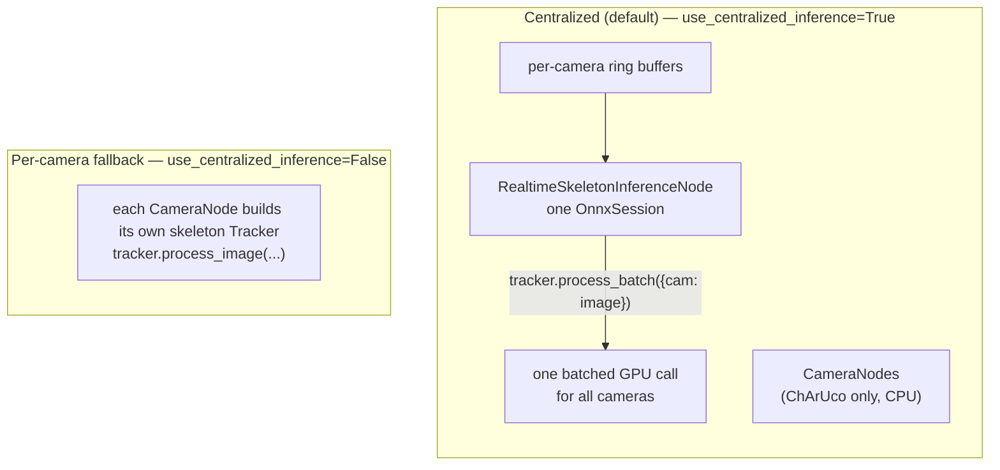

import { AiGeneratedBanner, Tip } from '@freemocap/skellydocs';

<AiGeneratedBanner />

# Tracking Integration (SkellyTracker)

FreeMoCap does not implement pose estimation itself — it delegates that to
[**SkellyTracker**](https://freemocap.github.io/skellytracker/), which exposes a
unified `Tracker → Session → Detector` API and owns **batched multi-camera
inference**. This page documents the seam: how the FreeMoCap backend builds and
drives SkellyTracker `Tracker`s.

<Tip shortInfo="SkellyTracker has its own docs at freemocap.github.io/skellytracker. It owns the detector implementations (MediaPipe, RTMPose, YOLOX, ArUco, ChArUco), the ONNX/CoreML sessions, temporal smoothing, and the batched process_batch() inference call. FreeMoCap orchestrates it across cameras and consumes the resulting Observations." />

## The bridge: `tracker_factory.py`

Every `Tracker.create()` call lives in one module —
`core/tracking/tracker_factory.py` — so that detector-registry import side effects,
config construction, and session creation happen in exactly one place. Other
modules import these builders rather than constructing trackers directly.

| Builder | Backend session | Produces |
|---|---|---|
| `build_charuco_tracker(board_def)` | `CpuSession` | ChArUco board detector (calibration markers) |
| `build_skeleton_onnx_session(batch_size, model_name, …)` | `OnnxSession` | Shared RTMPose + YOLOX session (batch size = camera count) |
| `build_skeleton_tracker(onnx_session, …)` | (uses the OnnxSession above) | Body-pose `Tracker` (YOLOX person crop → RTMPose) with `BBoxPolicyConfig` |
| `build_mediapipe_tracker(…)` | `MediaPipeSession` | MediaPipe body + hands + face `Tracker` |

Each builder returns a SkellyTracker `Tracker` (and, where relevant, the
`Session` so the caller can `close()` it). Per frame, FreeMoCap calls
`tracker.process_image(image, frame_number, state)` (single) or
`tracker.process_batch(images_dict, …)` (multi-camera) and receives an
`Observation` + updated `TrackerState`.

## Two inference modes

Skeleton inference runs in one of two modes, selected by
`RealtimePipelineConfig.use_centralized_inference` (**default: `True`**).

- **Centralized (default).** The dedicated `RealtimeSkeletonInferenceNode` owns a
  single `OnnxSession` and calls `tracker.process_batch(images_dict)` — **one
  batched GPU call per frame for all cameras**. In this mode `CameraNode`s run
  **ChArUco detection only** (CPU) and skip skeleton inference.
- **Per-camera (fallback).** With `use_centralized_inference=False`, each
  `CameraNode` builds its own skeleton `Tracker` and calls `process_image()`
  itself. This uses more GPU memory and has no batching benefit — it's mainly
  useful for CPU-bound setups or when a single dedicated GPU worker isn't
  desired.

See [Pipeline Architecture](./backend-pipeline-architecture.mdx) for how these
nodes fit into the realtime pipeline, and
[SkellyTracker's multi-camera batching guide](https://freemocap.github.io/skellytracker/guides/multi-camera-batching)
for how `process_batch` works internally.

## Tracker schemas

So the frontend can render keypoints and skeleton connections without hardcoding
any tracker's layout, the backend sends a **tracker-schema handshake** on connect.
Each active tracker is described by a `TrackerDefinition`
(`core/tracking/tracker_definitions.py` — e.g. `RTMPOSE_WHOLEBODY_DEFINITION`,
`MEDIAPIPE_WHOLEBODY_DEFINITION`), carrying its `tracked_points` and `connections`.
These are sent as a `TrackerSchemasMessage` over the WebSocket. See the
[API Boundary](./api-boundary.mdx) page for the message shape.

## Who owns what

| Concern | Owner |
|---|---|
| Detector implementations (MediaPipe, RTMPose, YOLOX, ArUco, ChArUco) | SkellyTracker |
| ONNX / CoreML sessions, execution-provider selection | SkellyTracker |
| Batched multi-camera inference (`process_batch` / `run_batched`) | SkellyTracker |
| Temporal smoothing (bbox policy, keypoint filtering) | SkellyTracker |
| Building/configuring trackers for FreeMoCap's needs (`tracker_factory`) | FreeMoCap |
| Running trackers across camera/video nodes; collecting `Observation`s | FreeMoCap |
| Triangulation, skeleton filtering, calibration, export | FreeMoCap |

## Cross-references

- **SkellyTracker docs**: [freemocap.github.io/skellytracker](https://freemocap.github.io/skellytracker/)
  — the `Tracker → Session → Detector` API, detectors, sessions, and batched inference.
- [Pipeline Architecture](./backend-pipeline-architecture.mdx) — realtime/posthoc node topology.
- [Mocap & Skeleton Processing](./backend-mocap.mdx) — what happens to the `Observation`s downstream.
