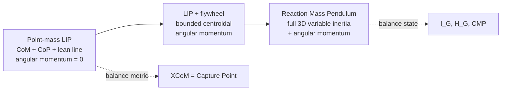

import { AiGeneratedBanner, Tip } from '@freemocap/skellydocs';

<AiGeneratedBanner />

# Centroidal Kinematics & the Reaction Mass Pendulum

<Tip shortInfo="STATUS (2026-06-21): Phase 1 is IMPLEMENTED end-to-end — the point-mass reaction-mass ellipsoid + ground references compute in the realtime backend and render in the viewport (live visual confirmation still pending hardware). Phase 2's anthropometric data (de Leva) has landed; Phase 2 compute and Phase 3+ remain proposed. Each page notes what's built vs planned." />

## What this is

freemocap already reconstructs a 3D skeleton per frame and computes the whole-body
**center of mass (CoM)** and the **extrapolated center of mass (XCoM)**. This proposal
adds the next layer of whole-body dynamics: a compact, principled description of the
body's **rotational** state about its center of mass.

Concretely, per frame we want to compute and visualize:

- the **composite centroidal inertia** `I_G` — how the body's mass is distributed about
  its CoM, rendered as the **reaction-mass ellipsoid**;
- the **centroidal angular momentum** `H_G` — how much rotational "spin" the body is
  carrying, and the equivalent body angular velocity `ω = I_G⁻¹ H_G`;
- a unified set of **ground-reference points** — CoP, XCoM, and the Centroidal Moment
  Pivot (CMP) — that together describe balance.

The result is a single, coherent **kinematic state of the body** that can be streamed to
the frontend and drawn alongside the skeleton.

## Why — the model hierarchy

Every reduced-order balance model in the biomechanics / humanoid-robotics literature is a
point on one spectrum, distinguished by *how much rotational inertia it admits*. freemocap
currently sits at the simplest end. This proposal moves it to the rich end.

- The **point-mass linear inverted pendulum (LIP)** throws angular momentum away. Its
  balance metric is the **XCoM**, which is mathematically identical to the **instantaneous
  capture point** — the same quantity discovered independently by Hof (2008) in
  biomechanics and Pratt and colleagues in robotics.
- The **LIP + flywheel** model (Pratt's capturability work) adds a reaction wheel at the
  CoM that can generate bounded angular momentum, which *extends* the region a body can
  recover balance from.
- The **Reaction Mass Pendulum (RMP)** (Lee & Goswami; Sanyal & Goswami) is that flywheel
  done properly: a full 3D, variable-inertia "reaction mass" at the CoM.

So the RMP is not a separate feature bolted on next to the XCoM — **it is the natural
completion of the XCoM.** freemocap has built the angular-momentum-free balance metric;
this proposal puts the angular momentum back.

## The elegant overlaps we want to highlight

A recurring theme — and a thing worth surfacing in the product itself — is that several
"different" quantities are mathematically the same point, discovered by different
communities:

| Quantity | Community | Definition |
|---|---|---|
| Extrapolated CoM (XCoM) | Biomechanics (Hof 2008) | `CoM_ground + v/ω₀` |
| Instantaneous capture point | Humanoid robotics (Pratt et al.) | `CoM_ground + v/ω₀` |
| Divergent component of motion | Control | unstable eigenvector of the LIP |

These are **one point under three names.** Likewise the **Centroidal Moment Pivot (CMP)**
coincides with the **center of pressure (CoP)** exactly when centroidal angular momentum
is not changing — so the CoP↔CMP separation is a direct, on-the-floor readout of the
reaction mass at work. See [Theory & Math](./01-theory-and-math.mdx) for the derivations.

## Scope and non-goals

**In scope:** per-frame *estimation* and *visualization* of centroidal kinematics from the
measured skeleton.

**Explicitly out of scope:** the *control* halves of these papers (Morse-Lyapunov
stabilization, proof-mass actuators, balance controllers). freemocap **measures** a human;
it does not actuate one. We borrow the representations, never the controllers.

## Status & phasing

| Phase | Content | Status |
|---|---|---|
| P0 | CoM + XCoM (per-frame) | **Done** (realtime pipeline) |
| P1 | Module scaffold + point-mass inertia ellipsoid + CoP + CMP | **Done** — backend tested, frontend typechecked; live smoke pending |
| P2 | Anthropometric segment inertia → real `I_G`; orbital `H_G` | **Data landed** (de Leva table); compute pending |
| P3 | Per-segment orientation → spin term; `ω`; full RMP | Planned |
| P4 | Posthoc/offline path + validation vs literature benchmarks | Planned |

See [Implementation Plan](./04-implementation-plan.mdx) for the detailed breakdown and
[Bibliography](./05-bibliography.mdx) for sources.
