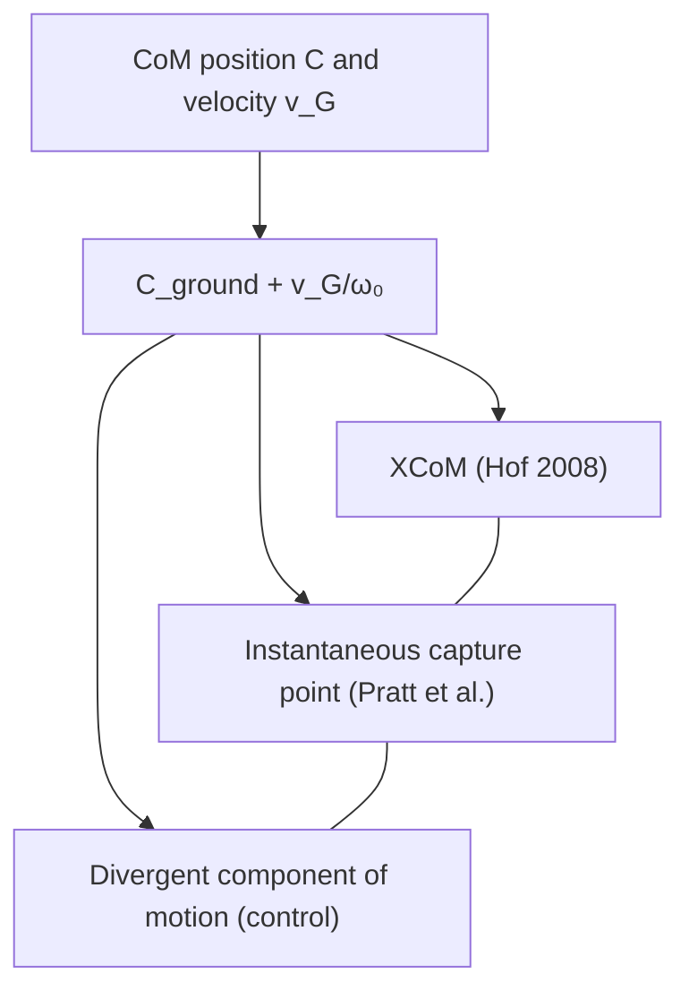

import { AiGeneratedBanner, Tip } from '@freemocap/skellydocs';

<AiGeneratedBanner />

# Theory & Math

<Tip shortInfo="Equations are written in code blocks because the docs site has no LaTeX renderer. Subscripts use unicode (ᵢ, ₃, ₀). Every formula here is cross-referenced to the source papers in the Bibliography." />

<Tip shortInfo="STATUS: the composite inertia I_G (point-mass form), its ellipsoid, and the ground references (CoP, XCoM, CMP) are implemented and streaming (Phase 1). Real segment inertia Jᵢ and angular momentum H_G / ω are Phase 2; the equations are written here in full so the implementation has one place to refer back to." />

This page is the mathematical backbone of the proposal. The good news: the core estimate
is short, and the central equations appear — identically — in four independent papers, so
there is no ambiguity left to resolve.

## Notation

```text
C        whole-body center of mass (CoM), world frame            (3,)
mᵢ       mass of segment i                                       scalar
cᵢ       CoM position of segment i, world frame                  (3,)
dᵢ       cᵢ − C   (segment CoM relative to whole-body CoM)       (3,)
Jᵢ       inertia tensor of segment i about its own CoM, world    (3,3)
vᵢ       velocity of segment i CoM                               (3,)
v_G      velocity of whole-body CoM                              (3,)
ωᵢ       angular velocity of segment i                           (3,)
I₃       3×3 identity
g        gravitational acceleration magnitude (9810 mm/s²)       scalar
```

Units are **millimeters** throughout, matching the realtime pipeline's coordinate system
(set by ChArUco calibration). Gravity is `9810 mm/s²`.

## 1. Composite centroidal inertia `I_G`

The heart of the whole thing. For each body segment, transport its inertia to the
whole-body CoM via the parallel-axis theorem and sum:

```text
I_G = Σ over segments [ Jᵢ + mᵢ ( (dᵢ·dᵢ) I₃ − dᵢ dᵢᵀ ) ]
```

`I_G` is a 3×3 symmetric positive-definite matrix. It is the body's instantaneous
rotational inertia about its center of mass — called the **centroidal composite rigid body
inertia (CCRBI)** or **locked inertia**. This is exactly the "variable body inertia" the
Reaction Mass Pendulum represents.

<Tip shortInfo="Four-source confirmation: this is Sanyal & Goswami 2013 (J_L term), Orin/Goswami/Lee 2013 (Eq. 22, I_G = X_Gᵀ I X_G), Lee & Goswami 2009 (Eq. 9/12, locked inertia), and Popovic/Goswami/Herr 2005 (I(r_CM)). The same matrix under four notations." />

### The reaction-mass ellipsoid

Eigendecompose `I_G`:

```text
I_G = V · diag(λ₁, λ₂, λ₃) · Vᵀ          # numpy: np.linalg.eigh
```

- `V` columns are the **principal axes** → the ellipsoid's orientation.
- `λ` are the **principal moments of inertia** → the ellipsoid's size.
- Render an ellipsoid at the CoM oriented by `V` with semi-axes proportional to `√λ` (or to
  the radii of gyration `√(λ/M)`, where `M = Σ mᵢ`).

The RMP literature mechanically realizes this ellipsoid as "six proof masses on three
orthogonal tracks." That is a robot-building metaphor: a pair of masses at `±sᵢ` along axis
`i` contributes `2 mₚ sᵢ² (I₃ − eᵢeᵢᵀ)`, the point-mass inertia formula. For *estimation
and rendering we never need the proof masses* — we draw the ellipsoid straight from `V` and
`λ`.

## 2. Centroidal angular momentum `H_G`

The quantity a point-mass model cannot represent, and the reason the RMP exists:

```text
H_G = Σ over segments [ Jᵢ ωᵢ  +  mᵢ dᵢ × (vᵢ − v_G) ]
        \_____ spin _____/      \________ orbital ________/
```

The equivalent whole-body ("average") angular velocity follows directly:

```text
ω = I_G⁻¹ H_G
```

This is Orin/Goswami/Lee 2013 Eq. 24 (their "average spatial velocity"), and Popovic/
Goswami/Herr 2005 Eq. 17a (`ω(t) = I(r_CM)⁻¹ L(r_CM)`).

<Tip shortInfo="Implementation note: the ORBITAL term needs only segment positions, velocities, and masses — no orientation. It dominates whole-body angular momentum. So we can ship orbital-only H_G first and add the spin term later." />

### Why the orbital/spin split matters

The **orbital** term (`Σ mᵢ dᵢ × (vᵢ − v_G)`) is the angular momentum from segment CoMs
swinging around the whole-body CoM. It requires only positions and velocities — data we
already have. It is the dominant contribution for most human movement.

The **spin** term (`Σ Jᵢ ωᵢ`) is each segment rotating about its own CoM. It requires
per-segment orientation and the segment inertia tensors, and is generally smaller. This
split gives us a natural phasing (orbital first, spin second).

## 3. The CoM ↔ XCoM ↔ capture point unification

freemocap already computes the XCoM (Hof 2008). The proposal makes its deeper meaning
explicit.

```text
ω₀   = √(g / l)          # l = CoM height above ground (pendulum length)
XCoM = C_ground + v_G / ω₀
```

This is *the same point* as the **instantaneous capture point** of the linear inverted
pendulum (the ground location you would step to in order to stop in one step). Koolen,
Pratt et al. state this explicitly: the capture point "was independently described by Hof
et al. and named the Extrapolated Center of Mass." It is also the unstable eigenvector of
the LIP — the **divergent component of motion**.



The practical upshot: freemocap's existing XCoM **is already** a 1-step capturability
metric for the point-mass model. The richer models below describe how generating angular
momentum (the RMP) extends balance beyond that single point.

## 4. Ground-reference points: CoP, ZMP, CMP

Three points on the ground, each describing a different facet of balance (Popovic/Goswami/
Herr 2005).

**Center of Pressure (CoP).** Where the ground reaction force acts. freemocap has no force
plate, so for now we approximate it as the **vertical ground projection of the CoM** — the
same point we already compute for the XCoM base. Good enough for a first pass; flagged as
estimated in all outputs.

<Tip shortInfo="Future upgrade, not in initial scope: the Zero Moment Point (= CoP on flat ground) can be reconstructed purely from kinematics + mass distribution (Popovic Eq. 5), no force plate needed. It uses the same anthropometric inertia data as I_G. Noted here for later." />

**Centroidal Moment Pivot (CMP).** The point where a line parallel to the ground reaction
force through the CoM meets the ground:

```text
CMP = CoM_ground − (F_horizontal / F_vertical) · z_CoM
```

The key property: **CMP = CoP exactly when the net moment about the CoM is zero** (i.e.
when centroidal angular momentum is not changing). When the body deploys its reaction mass,
the CMP separates from the CoP by an amount proportional to the horizontal moment about the
CoM. So:

- **CMP ≈ CoP** → point-mass regime; the XCoM tells the whole balance story.
- **CMP diverges from CoP** → the body is spending angular momentum (RMP regime).

This makes the CoP↔CMP pair a live, ground-plane readout of exactly what the 3D
reaction-mass ellipsoid is doing.

## 5. Putting it together — the body's kinematic state

Per frame, the complete centroidal description is:

```text
C            CoM position
v_G          CoM velocity
CoP          ground-reference (CoM projection, for now)
XCoM         = instantaneous capture point
CMP          centroidal moment pivot
I_G          composite centroidal inertia  → ellipsoid (V, λ)
H_G          centroidal angular momentum    → vector
ω            = I_G⁻¹ H_G                     → equivalent body spin
```

The next page, [Module Architecture](./02-module-architecture.mdx), describes the code that
produces this bundle; [Data Flow & Frontend](./03-data-flow-and-frontend.mdx) describes how it
travels to the viewport.
