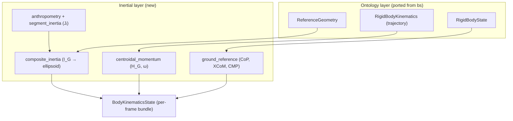

import { AiGeneratedBanner, Tip } from '@freemocap/skellydocs';

<AiGeneratedBanner />

# Module Architecture

<Tip shortInfo="STATUS: the inertial layer + per-frame online adapter + BodyKinematicsState are BUILT and wired into the realtime pipeline (Phase 1). The bs ontology port and centroidal_momentum are NOT built yet — deferred to Phase 2/3 (the point-mass ellipsoid needs no orientation). Files below are tagged ✅ built / ⏳ planned." />

## Goal

One coherent module that owns "the kinematic and inertial state of a rigid body / the whole
body," reusable by both pipelines, with clean boundaries so each piece can be understood and
tested on its own.

## Provenance: the `bs` kinematics_core ontology

The `bs` client repo (`clients/bs/python_code/kinematics_core`) already contains a
well-designed, purely **kinematic** ontology that we will pull into freemocap and refactor
(⏳ **planned for Phase 3**, when per-segment orientation first needs it — not required for the
Phase 1 point-mass ellipsoid, so not yet ported):

- `ReferenceGeometry` + `CoordinateFrameDefinition` — build a body-fixed coordinate frame
  from named keypoints (origin + one *exact* axis + one *approximate* axis, third by cross
  product, Gram-Schmidt orthonormalized).
- `RigidBodyState` — full per-instant state (position, velocity, orientation, angular
  velocity, accelerations).
- `RigidBodyKinematics` — a pose *trajectory* that lazily computes velocity, acceleration,
  and **angular velocity** (global + local) by quaternion finite-differencing.
- `Quaternion` / quaternion-trajectory + vectorized derivative helpers.

What it does **not** have is any notion of **mass, inertia, or momentum**. That is precisely
the layer this proposal adds on top.

<Tip shortInfo="Refactor, don't import (⏳ Phase 3, not yet done): we'll copy these models into freemocap, switch imports from python_code.* to freemocap.core.kinematics.*, and align with freemocap conventions. The bs repo stays a reference, not a dependency." />

## Proposed layout

```text
freemocap/core/kinematics/
├── reference_geometry.py      # ⏳ ported: ReferenceGeometry, CoordinateFrameDefinition, StaticPose
├── rigid_body_state.py        # ⏳ ported: RigidBodyState (per-instant)
├── rigid_body_kinematics.py   # ⏳ ported: RigidBodyKinematics (trajectory; lazy derivatives)
├── quaternion.py              # ⏳ ported: Quaternion (+ trajectory)
├── derivatives.py             # ⏳ ported: finite-difference helpers
│
├── inertial/                  # NEW — the layer bs does not have
│   ├── anthropometry.py       # ✅ de Leva 1996 table (mass, CoM, radii); F + M + mean default
│   ├── segment_inertia.py     # ⏳ per-segment inertia tensor Jᵢ from anthropometry + bone length
│   ├── composite_inertia.py   # ✅ I_G (parallel-axis sum) + eigh + equimomental semi-axes
│   ├── centroidal_momentum.py # ⏳ H_G (orbital + spin), ω = I_G⁻¹ H_G
│   └── ground_reference.py    # ✅ CoP (CoM projection), XCoM = capture point, CMP
│
├── body_kinematics_state.py   # ✅ the unified per-frame bundle (the public output)
└── online/                    # ✅ realtime per-frame adapter (rolling history)
    └── streaming_kinematics.py# ✅ per-frame I_G + ground-refs, 3-deep CoM history
```

**Legend:** ✅ built (Phase 1) · ⏳ planned (Phase 2/3). The ontology files at the top are not
yet ported — the point-mass ellipsoid and ground references need no orientation.



## Shared core, two consumers

The math, the anthropometric tables, and the data structures are shared. The **source of
derivatives** differs by pipeline:

| Concern | Realtime (built first) | Posthoc (later) |
|---|---|---|
| Velocities / angular velocity | per-frame finite differences over a small rolling history (the pattern already used for `prev_com` in the aggregator) | `RigidBodyKinematics` lazy whole-array derivatives (cleaner, less noisy) |
| Entry point | `online/streaming_kinematics.py` | trajectory ontology directly |
| Shared | `inertial/*` math, `anthropometry`, `BodyKinematicsState` | same |

This keeps a single source of truth for the *physics* while letting each pipeline use the
derivative method that suits it.

## Per-segment orientation strategy

The spin term of `H_G` (and a fully faithful inertia ellipsoid) needs each segment's
orientation. Locked decision:

- **Limb segments** (upper/lower arm, thigh, shank, foot): treat as **rods aligned with the
  bone vector**. A rod is axisymmetric, so its inertia about the long axis is negligible and
  spin about that axis contributes little — we need only the bone *direction* and its angular
  velocity (from the bone vector's rotation across frames).
- **Trunk / pelvis / head**: not rod-like, so build a real body frame with
  `ReferenceGeometry` (shoulders + hips define the trunk frame; this is exactly what the
  ported ontology is for).

A full per-segment Kabsch/Procrustes pose fit is the heavier alternative we can adopt later
if higher fidelity is needed; the rod+frame approach is the pragmatic default.

## Anthropometric data — the one new asset

The CoM calculation today uses only segment **mass fractions** and **CoM locations**
(skellyforge's `SegmentCenterOfMassDefinition`). The inertia ellipsoid additionally needs
**radii of gyration**. ✅ `anthropometry.py` now holds the **de Leva 1996 Table 4** values (8
primary segments; female + male tables; **mean used by default**) giving per-segment
`(k_sagittal, k_transverse, k_longitudinal)` as fractions of segment length, so:

```text
Jᵢ = mᵢ · diag( (k_sag·Lᵢ)², (k_trans·Lᵢ)², (k_long·Lᵢ)² )   # about segment CoM, segment frame
```

This was the only genuinely new *data* the proposal required, and it has **landed** (mass
fractions verified to sum to 1.0). Phase 1 still ships the point-mass ellipsoid (`Jᵢ = 0`);
Phase 2 feeds these radii in via `segment_inertia.py`.

## Boundaries & testability

Each unit has one job and a clear interface:

- ✅ `composite_inertia`: `composite_centroidal_inertia(...) → I_G`,
  `principal_axes_and_moments(I_G) → (moments, axes)`, `equimomental_semi_axes(...) → semi-axes`.
  Pure functions; unit-tested against analytic cases (two masses → `diag(0,2,2)`; uniform
  sphere → semi-axes = R).
- ⏳ `centroidal_momentum` (Phase 2): `H_G` (orbital + spin) and `ω = I_G⁻¹ H_G`. Will be
  tested against conservation cases (free-fall → constant `H_G`).
- ✅ `ground_reference`: `center_of_pressure_ground_projection`, `extrapolated_center_of_mass`,
  `centroidal_moment_pivot`. Pure functions; unit-tested incl. the point-mass limit (zero CoM
  acceleration → CMP = CoP).

The realtime adapter and the trajectory ontology both call these same pure functions.
