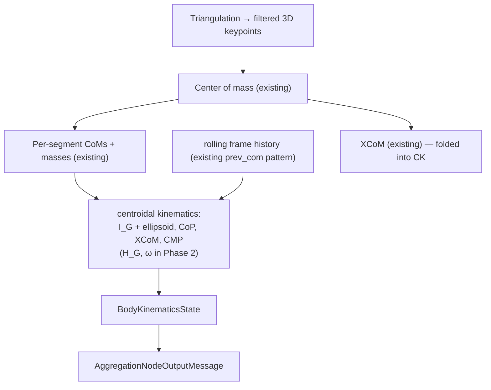
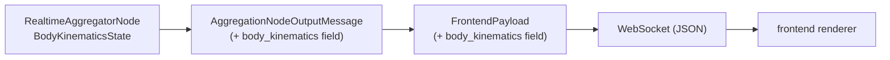

import { AiGeneratedBanner, Tip } from '@freemocap/skellydocs';

<AiGeneratedBanner />

# Data Flow & Frontend

<Tip shortInfo="STATUS: IMPLEMENTED (Phase 1). The bundle rides the existing channel — added to the aggregator output and frontend payload exactly like xcom. The struct below reflects what ships today; H_G / ω arrive in Phase 2." />

## The per-frame bundle: `BodyKinematicsState`

A single struct produced once per frame, carrying the complete centroidal description. It is
small (a handful of vectors plus one 3×3 / quaternion), so it can travel as JSON alongside
the existing low-density metadata.

```python
class BodyKinematicsState(msgspec.Struct):
    # --- points (world frame, mm) ---
    center_of_mass: Point3d
    com_velocity: Point3d | None = None
    center_of_pressure: Point3d | None = None  # CoM ground projection (estimated; no force plate)
    xcom: Point3d | None = None                # extrapolated CoM = instantaneous capture point
    cmp: Point3d | None = None                 # centroidal moment pivot

    # --- reaction-mass ellipsoid (point-mass, Phase 1) ---
    ellipsoid_semi_axes: Point3d | None = None # equimomental semi-axes (mm)
    ellipsoid_axis_x: Point3d | None = None    # principal axes as basis vectors
    ellipsoid_axis_y: Point3d | None = None    #   (a quaternion form arrives with
    ellipsoid_axis_z: Point3d | None = None    #    the ontology port in Phase 3)

    cop_is_estimated: bool = True              # honesty flag: no force plate
```

This is the shape that **ships today**. Phase 2 adds `centroidal_angular_momentum` (`H_G`) and
`body_angular_velocity` (`ω`). Derivatives come from a 3-deep CoM history, so `xcom` populates
from frame 2 and `cmp` from frame 3 (ellipsoid + CoP need no history → frame 1).

## Where it is produced (realtime)

The realtime aggregator already computes CoM and XCoM in its per-frame block and keeps a
`prev_com` / `prev_com_time` history for velocities. The centroidal-kinematics computation
slots in right there, immediately after the CoM step, reusing that same history pattern.



## How it travels to the frontend

The path mirrors the current `xcom` field exactly:



✅ **Implemented.** Concretely:
- `AggregationNodeOutputMessage` and `FrontendPayload` each gained a
  `body_kinematics: BodyKinematicsState | None` field (the heavy 3D keypoints still travel in
  the binary message; this bundle is low-density JSON like CoM/XCoM).
- The existing `Point3d` enc-hook (`websocket_server.py`) serializes the nested struct — no
  transport changes. Verified: a `FrontendPayload` carrying `body_kinematics` encodes through
  the real websocket encoder.
- Frontend mirror of the CoM/XCoM lane: `ServerContextProvider` parses `payload.body_kinematics`
  → `BodyKinematicsForwarder` (`ThreeJsCanvas`) `postMessage` → worker → `WorkerDataStore`
  (`bodyKinematicsChan`) → `BodyKinematicsRenderer`.

## Frontend rendering

✅ Implemented in `BodyKinematicsRenderer.tsx`, mounted in `ThreeJsScene` and gated by
`visibility.bodyKinematics` (default on), alongside the skeleton / CoM / XCoM that already render:

- **Reaction-mass ellipsoid** at the CoM — a unit sphere scaled by `ellipsoid_semi_axes` and
  oriented via `Matrix4.makeBasis(axis_x, axis_y, axis_z)`. Translucent violet with `depthWrite`
  off so it ghosts the skeleton (cf. the green ellipsoid in Lee & Goswami 2009, Fig. 2).
- **CMP marker + CoP→CMP line** — a magenta ground marker plus the line whose length is the
  on-the-floor readout of angular-momentum rate. (CoM, XCoM, and the CoM ground-projection are
  already drawn by `CenterOfMassRenderer`, so this renderer adds only what's new.)
- ⏳ **Angular-momentum arrow** (`H_G` / `ω`) — arrives with Phase 2.

<Tip shortInfo="Sub-elements gated by visibility.reactionMassEllipsoid / centroidalMomentPivot (default on). A ViewportOverlay toggle row is a small deferred follow-up; ELLIPSOID_SCALE in the renderer tunes display size." />

## Posthoc / offline output

When the posthoc path is built (Phase 4), the same `BodyKinematicsState` fields are written
as per-frame trajectories into the recording's data store (parquet / `.npy`), so the
centroidal kinematics are available for offline analysis and validation, consistent with how
CoM trajectories are saved today.
