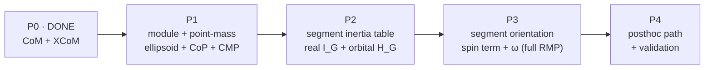

import { AiGeneratedBanner, Tip } from '@freemocap/skellydocs';

<AiGeneratedBanner />

# Implementation Plan

<Tip shortInfo="Each phase is independently shippable and leaves the system in a working state. The two 'richness' axes — inertia (point-mass → real segment inertia) and angular momentum (orbital → spin) — are deliberately staged so value lands early." />

## Progress tracker

High-level status — checked off as we go. Granular task checkboxes live in each phase below.

- [x] **Phase 0 — Center of mass + XCoM** _(pre-existing)_
- [x] **Phase 1 — Module scaffold + point-mass ellipsoid + ground references** — _backend ✅ tested ([plan](./plans/2026-06-21-phase-1-backend-core.mdx)) + frontend ✅ typechecked ([plan](./plans/2026-06-21-phase-1-frontend.mdx)); live visual smoke pending hardware_
- [ ] **Phase 2 — Real segment inertia + orbital angular momentum**
- [ ] **Phase 3 — Per-segment orientation + spin term (full RMP)**
- [ ] **Phase 4 — Posthoc path + validation**

## Phasing at a glance

## Phase 0 — Center of mass + XCoM (done)

Already in the realtime pipeline: per-frame whole-body and per-segment CoM
(`center_of_mass.py`) and the XCoM (Hof 2008). This proposal builds directly on the data
these already produce (`segment_coms`, mass fractions, the `prev_com` velocity history).

- [x] Whole-body + per-segment center of mass (per frame)
- [x] XCoM / instantaneous capture point (per frame)

## Phase 1 — Module scaffold + point-mass ellipsoid + ground references

**Goal:** stand up `freemocap/core/kinematics/` and get a meaningful reaction-mass ellipsoid
and the ground-reference overlay on screen — with **no new data** required.

- [x] Scaffold the `freemocap/core/kinematics/` package (with `inertial/` and `online/`).
- [x] Add `inertial/composite_inertia.py`: point-mass `I_G` from masses + segment CoMs,
      `eigh` → principal axes/moments, and equimomental display semi-axes.
- [x] Add `inertial/ground_reference.py`: CoP (CoM ground projection), XCoM (move/centralize
      the existing computation here), CMP.
- [x] Add `body_kinematics_state.py` (`BodyKinematicsState`) and
      `online/streaming_kinematics.py` (per-frame wrapper using the rolling-history pattern).
- [x] Wire into `RealtimeAggregatorNode` after the CoM step; add `body_kinematics` to
      `AggregationNodeOutputMessage` and `FrontendPayload`. _(serialization verified through
      the real websocket encoder; live camera-session smoke still pending hardware.)_
- [x] Frontend: render the reaction-mass ellipsoid + CMP / CoP→CMP overlay
      (`BodyKinematicsRenderer`), default-on. _tsc clean; live visual smoke pending hardware._

> **Resequenced (2026-06-21):** the bs ontology port (ReferenceGeometry / RigidBodyKinematics
> / quaternion / derivatives) moved to Phase 3 — the point-mass ellipsoid and ground references
> need no orientation, so the port is not on the Phase 1 critical path.

**Acceptance:** ellipsoid stretches/tumbles with body mass distribution; CoP, XCoM, CMP draw
on the ground plane; CMP ≈ CoP when the subject is still, separating during dynamic motion.
Hot-loop cost stays negligible (target well under 0.1 ms/frame for the math).

## Phase 2 — Real segment inertia + orbital angular momentum

**Goal:** make the ellipsoid anatomically correct and add (most of) the angular momentum.

- [x] Add `inertial/anthropometry.py`: de Leva 1996 Table 4 radii of gyration (+ mass & CoM),
      female + male tables with the **mean as default**. Single source of truth; mass fractions
      sum to 1.0 (verified by test).
- [ ] Add `inertial/segment_inertia.py`: `Jᵢ = mᵢ · diag((r·L)²)` about each segment CoM.
- [ ] Feed `Jᵢ` into `composite_inertia` (drop the point-mass assumption).
- [ ] Add `inertial/centroidal_momentum.py` with the **orbital** term only:
      `H_G ≈ Σ mᵢ dᵢ × (vᵢ − v_G)` (needs segment-CoM velocities — extend the rolling history).
- [ ] Add `H_G` (and `ω = I_G⁻¹ H_G`) to `BodyKinematicsState`; render the `H_G` arrow.

**Acceptance:** ellipsoid matches expected human segment-inertia proportions; `H_G` responds
sensibly to arm swing / trunk rotation; values are in a plausible range vs literature.

## Phase 3 — Per-segment orientation + spin term (full RMP)

**Goal:** complete `H_G` and the inertia model with rotational detail.

- [ ] Port the bs `kinematics_core` ontology into `freemocap/core/kinematics/`
      (`reference_geometry`, `rigid_body_state`, `rigid_body_kinematics`, `quaternion`,
      `derivatives`; imports → `freemocap.core.kinematics.*`; port the bs tests). Moved here
      from Phase 1 — first needed for per-segment orientation.
- [ ] Per-segment orientation: bone-vector frames for limbs; `ReferenceGeometry` frames for
      trunk / pelvis / head (shoulders + hips). Derive `ωᵢ` via the ported angular-velocity
      machinery, per-frame.
- [ ] Add the **spin** term `Σ Jᵢ ωᵢ` to `centroidal_momentum`.
- [ ] Rotate segment inertia tensors into world frame in `composite_inertia` (`R Jᵢ Rᵀ`) for
      full fidelity.

**Acceptance:** full `H_G` (orbital + spin) and `ω`; spin term is a sensible secondary
contribution; ellipsoid orientation tracks trunk/limb configuration.

## Phase 4 — Posthoc path + validation

**Goal:** offline parity and trustworthiness.

- [ ] Consume the same `inertial/*` core from the posthoc pipeline using `RigidBodyKinematics`
      trajectories (clean whole-array derivatives → less-noisy `H_G`).
- [ ] Persist per-frame `BodyKinematicsState` fields into the recording data store.
- [ ] Validate against literature benchmarks: spin angular momentum magnitude in gait (Herr &
      Popovic), CMP-within-support-base behavior (Popovic/Goswami/Herr), and the point-mass
      limit (zero `H_G` → CMP = CoP, XCoM = capture point).

**Acceptance:** offline and realtime agree within filtering differences; benchmarks fall in
published human ranges.

## Cross-cutting principles

- **Estimation only.** No controllers, no actuators (see [Overview](./00-overview.mdx) scope).
- **Pure functions at the core.** All physics lives in pure, unit-tested functions called by
  both pipelines.
- **Honesty flags.** The CoP is estimated (no force plate); outputs carry a flag and the
  docs/UI say so.
- **Fail loudly.** No silent fallbacks; unexpected states raise. (Phase boundaries are the
  valid place to gate on data availability, e.g. needing ≥2 frames for velocities.)
- **Single source of truth.** Anthropometry, the XCoM formula, and the inertia math each have
  exactly one definition point in `freemocap/core/kinematics/`.

## Open questions to resolve during build

- Final field set + serialization for `BodyKinematicsState` (and binary vs JSON if it grows).
- de Leva vs Dumas as the default anthropometric source (diagonal radii vs full tensors).
- Whether trunk-frame definition reuses the FABRIK canonical landmarks or defines its own
  `ReferenceGeometry`.
- Ellipsoid scaling convention for display (`√λ` vs radii of gyration vs a tuned visual gain).
