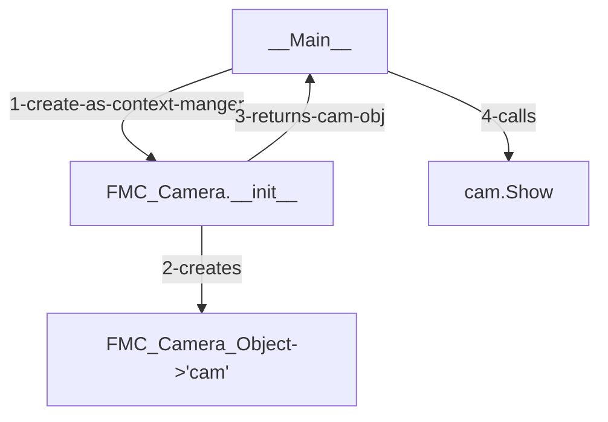
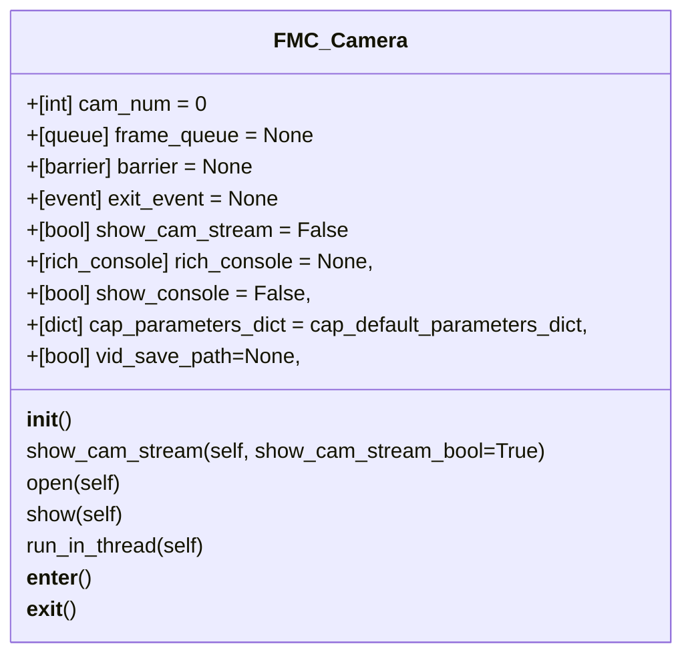

# FMC_Camera

```mermaid
graph TD
    M[__Main__]--1-create-as-context-manger-->I[FMC_Camera.__init__];
    I--2-creates-->C[FMC_Camera_Object->'cam']
    I--3-returns-cam-obj-->M
    M--4-calls-->Cs[cam.Show]    
```

```mermaid
classDiagram
    class FMC_Camera{
        +[int] cam_num = 0
        +[queue] frame_queue = None
        +[barrier] barrier = None
        +[event] exit_event = None
        +[bool] show_cam_stream = False
        +[rich_console] rich_console = None,       
        +[bool] show_console = False,       
        +[dict] cap_parameters_dict = cap_default_parameters_dict,
        +[bool] vid_save_path=None, 
        __init__()
        show_cam_stream(self, show_cam_stream_bool=True)
        open(self)
        show(self)
        run_in_thread(self)
        __enter__()
        __exit__()
    }
    
```

