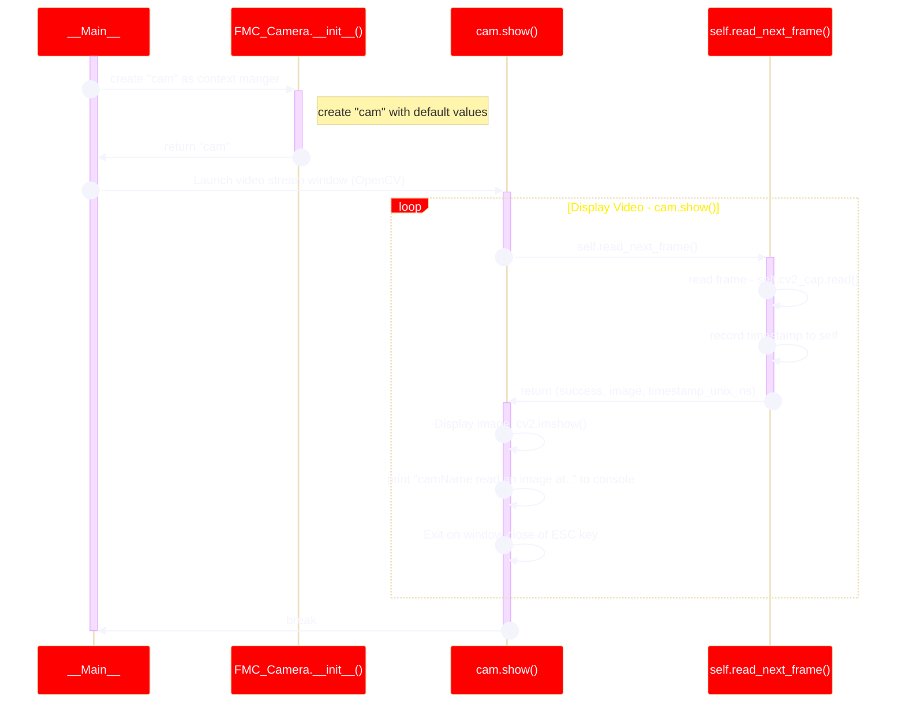
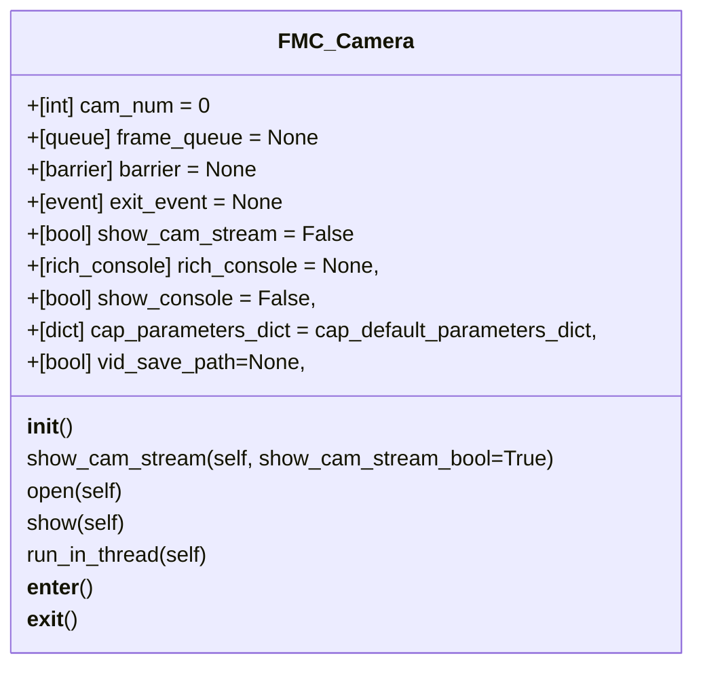

# FMC_Camera
## Run as __Main__ file

```mermaid
%%{init: {"securityLevel": "loose","theme": "base", "themeVariables": { "fontSize":"24px","primaryColor": "#fff4dd", "primaryTextColor":"#f4f4fd", "actorBkg":"#FF0000", "loopTextColor":"#fff000"}}}%%

sequenceDiagram
autonumber
    participant M as __Main__
    participant I as FMC_Camera.__init__()
    participant S as cam.show()
    participant R as self.read_next_frame()
    activate M
    
    
    M->>+I:create "cam" as context manger
    Note right of I: create "cam" with default values
    I->>-M:return "cam"
    M->>+S:Launch video stream window (OpenCV)
    loop Display Video - cam.show()
        S->>+R:self.read_next_frame()        
        deactivate S
        R->>R:read frame - self.cv2_cap.read()
        R->>R:record timestamp to self
        R->>-S:return (success, image, timestamp_unix_ns)
        activate S
        S->>S:Display image: cv2.imshow()
        S->>S:print "camName read an image at.." to console
        S->>S:Exit on window close of ESC key
        end
        S->>-M:break

        

    
    deactivate M
    

```

```mermaid
classDiagram
    class FMC_Camera{
        +[int] cam_num = 0
        +[queue] frame_queue = None
        +[barrier] barrier = None
        +[event] exit_event = None
        +[bool] show_cam_stream = False
        +[rich_console] rich_console = None,       
        +[bool] show_console = False,       
        +[dict] cap_parameters_dict = cap_default_parameters_dict,
        +[bool] vid_save_path=None, 
        __init__()
        show_cam_stream(self, show_cam_stream_bool=True)
        open(self)
        show(self)
        run_in_thread(self)
        __enter__()
        __exit__()
    }
    
```

