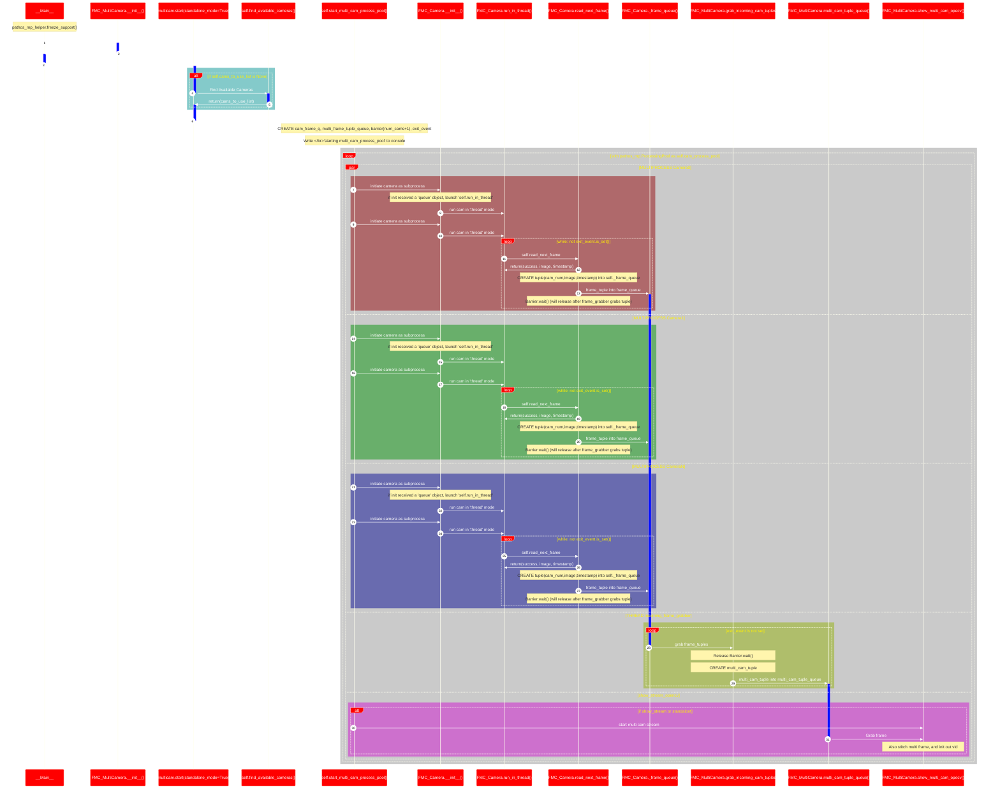
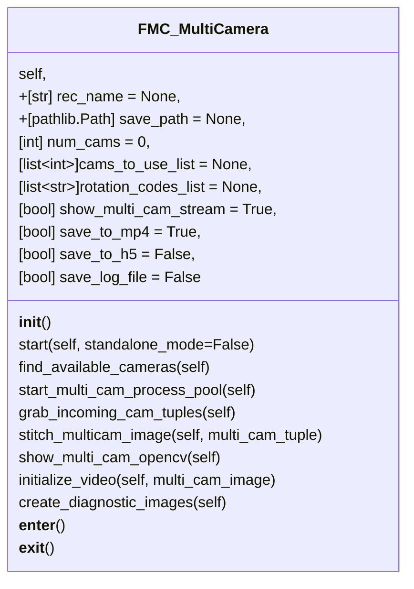

____
 # FMC_MultiCamera
>
>   A class to launch a 'multi_camera' which acts like a single camera but pulls synchronized images from multiple USB webcams
> 
## Class definition and contents

## Run as __Main__ file - Code sequence chart

