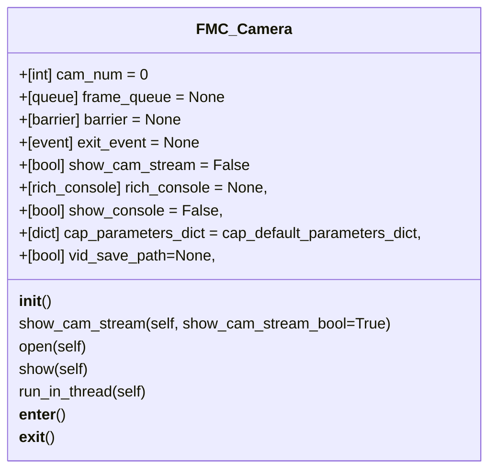
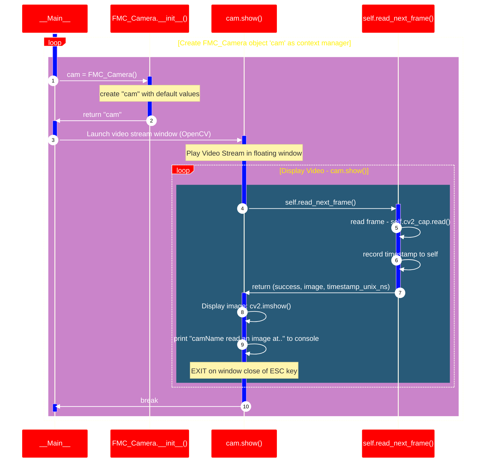

____
 # FMC_Camera
>
>   A class to open and run a single webcam, either in 'standalone' mode, or as part of a MultiCam object
## Class definition and contents

---
## Run as __Main__ file - Code sequence chart

